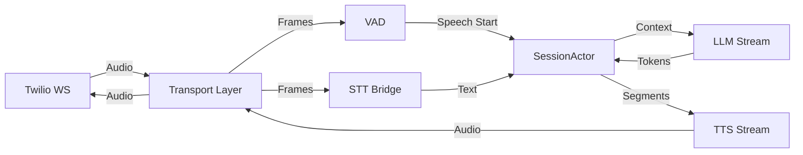

# System Architecture

## 1. Overview
The `voice_agent_v4` project is a sophisticated, modern Python application designed for real-time voice interactions using Twilio, OpenAI, and Cartesia. It employs an event-driven, actor-based architecture to ensure deterministic state management and low-latency processing.

### Core Technologies
- **Runtime**: Python 3.12+ with `asyncio`.
- **Transport**: FastAPI + Twilio Media Streams (WebSocket, μ-law 8kHz).
- **AI Services**:
    - **STT**: Cartesia (Streaming).
    - **LLM**: OpenAI GPT-4o/GPT-5-nano (Streaming).
    - **TTS**: Cartesia (Streaming).
- **Observability**: Prometheus metrics and OpenTelemetry tracing.

---

## 2. High-Level Architecture

### 2.1 Actor-Per-Session Model
The core of the system is the `SessionActor` (in `actor.py`).
- **Single Source of Truth**: A single coroutine serializes all state transitions per `call_sid`.
- **Event Bus**: All components (Twilio, STT, LLM, TTS) communicate via a typed event bus.
- **State Machine**: The actor manages transitions between `LISTENING`, `THINKING`, and `SPEAKING` states.

### 2.2 End-to-End Data Flow

### 2.3 Key Invariants
1.  **Turn Isolation**: Events from previous turns are dropped to prevent race conditions.
2.  **Immediate Barge-in**: User speech triggers immediate cancellation of TTS/LLM and clears the audio buffer.
3.  **Exactly-Once Replies**: The state machine ensures only one assistant reply is generated per user turn.

---

## 3. Memory System (MCP)
The system implements a Model Context Protocol (MCP) based multi-layer cached memory system.

### 3.1 Hierarchy
1.  **L1 Cache (Session)**: Redis/Memory. Ultra-fast access to current session context.
2.  **L2 Cache (Vector)**: Pinecone/Weaviate. Semantic search for cross-session retrieval.
3.  **L3 Cache (Persistent)**: PostgreSQL/MongoDB. Long-term archival.

### 3.2 Integration
The `MCPMemoryManager` orchestrates storage and retrieval, providing the `SessionActor` with relevant context (user preferences, past facts) to enhance the conversation.

---

## 4. Observability

### 4.1 Metrics
The application exposes Prometheus metrics at `/metrics`.

**Key Metrics**:
- `turn_latency_ms`: End-to-end turn processing time.
- `time_to_first_audio_ms`: Latency from user speech end to first assistant audio.
- `barge_in_reaction_ms`: Time to stop playback after interruption.
- `cartesia_tts_error_total`: Vendor error counters.

### 4.2 Tracing
Structured logs provide a timeline of every call, including:
- `call_sid`
- `turn_id`
- `state` transitions
- `event` sequences

---

## 5. Resilience
- **Circuit Breakers**: Protect against cascading failures from OpenAI and Cartesia.
- **Retries**: `tenacity` is used for transient failures with exponential backoff.
- **Graceful Degradation**: Fallback audio messages are played when services are unavailable.
