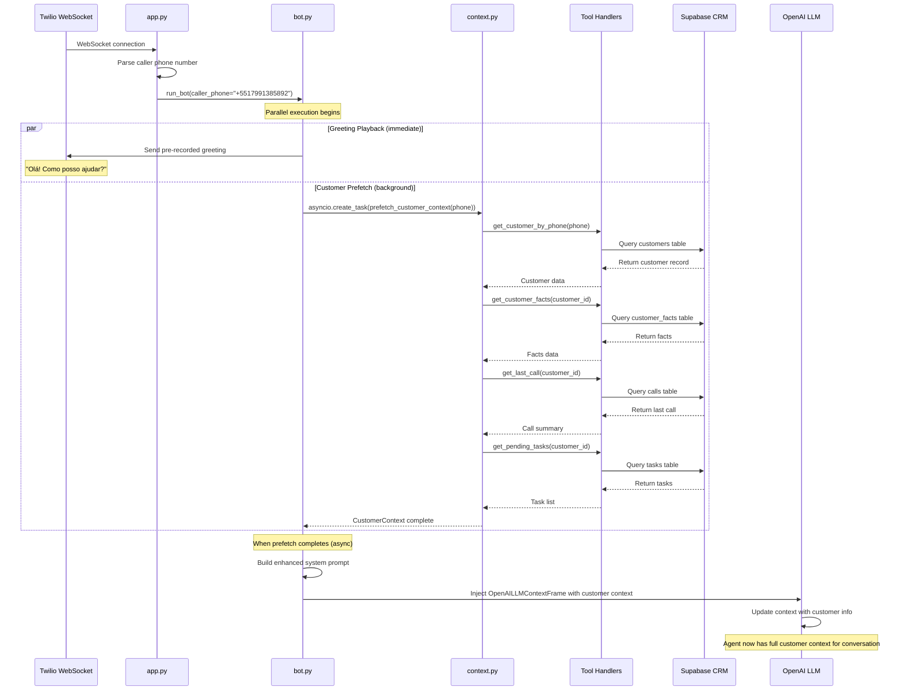

# Customer Context Prefetch - Technical Documentation

**Feature:** Parallel Customer Context Loading  
**Version:** Pipecat Migration (v5)  
**Status:** ✅ Active (Optimized for parallel execution)  
**Last Updated:** January 12, 2026

---

## Overview

The **Customer Context Prefetch** feature automatically loads customer information from the CRM database as soon as a call connects, **before the conversation even begins**. This ensures the AI agent has full context about the caller from the first moment they speak.

### Why This Matters

**Before Prefetch:**
- Agent: "How can I help you?"
- Caller: "I'm calling about my order"
- Agent has to ask: "Can I have your name and phone number?"
- Customer gets frustrated: "You already have my number, you called me!"

**With Prefetch:**
- Agent: "Hello [Customer Name]! I see you have a pending task to follow up on your recent order. How can I help you today?"
- Caller feels recognized and valued
- Conversation starts with full context

---

## Feature Implementation (Pipecat Version)

### Architecture Changes from Pre-Pipecat

| Aspect | Pre-Pipecat (v4) | Pipecat (v5) | Impact |
|--------|-----------------|--------------|---------|
| **Execution** | Synchronous blocking | **Async parallel** | ⚡ No delay to greeting |
| **Timing** | Before greeting | **During greeting** | ✅ 500-2000ms saved |
| **Injection** | Direct to context | **OpenAILLMContextFrame** | 🔧 Framework-native |
| **Fallback** | Hard failure | Graceful degradation | 🛡️ More resilient |
| **Config** | Always on | Feature flag toggle | ⚙️ Flexible |

### Current Implementation Flow



---

## What Gets Prefetched

The system makes **4 parallel tool calls** to gather comprehensive customer information:

### 1️⃣ Customer Record (`get_customer_by_phone`)
**Purpose:** Core identity information

**Query:**
```sql
SELECT * FROM customers WHERE phone = '+5517991385892' LIMIT 1;
```

**Data Retrieved:**
- `customer_id` - Unique identifier
- `name` - Customer's full name
- `email` - Email address
- `phone` - Phone number (normalized)
- `status` - Account status (active, inactive, lead, etc.)
- `company` - Company name (if B2B)
- `notes` - General notes about customer
- `created_at` - When customer was added to CRM
- `updated_at` - Last update timestamp

**Example Result:**
```json
{
  "customer_id": "cust_abc123",
  "name": "João Silva",
  "email": "joao.silva@example.com",
  "phone": "+5517991385892",
  "status": "active",
  "company": "Acme Corp",
  "created_at": "2025-01-15T10:30:00Z"
}
```

---

### 2️⃣ Customer Facts (`get_customer_facts`)
**Purpose:** Personalization data and preferences

**Query:**
```sql
SELECT * FROM customer_facts 
WHERE customer_id = 'cust_abc123' 
ORDER BY created_at DESC 
LIMIT 10;
```

**Data Retrieved:**
- `fact_type` - Category (preference, note, requirement, etc.)
- `fact_value` - The actual information
- `created_at` - When this was recorded

**Example Results:**
```json
[
  {
    "fact_type": "preferred_contact_time",
    "fact_value": "afternoons after 2pm",
    "created_at": "2025-12-01T14:20:00Z"
  },
  {
    "fact_type": "language_preference",
    "fact_value": "Portuguese",
    "created_at": "2025-11-15T09:10:00Z"
  },
  {
    "fact_type": "last_product_interest",
    "fact_value": "Premium Plan",
    "created_at": "2025-11-20T16:45:00Z"
  }
]
```

**Use Cases:**
- "I see you prefer calls in the afternoon"
- "Last time you were interested in our Premium Plan"
- "As a vegetarian, let me suggest..."

---

### 3️⃣ Last Call Summary (`get_last_call`)
**Purpose:** Conversation continuity

**Query:**
```sql
SELECT * FROM calls 
WHERE customer_id = 'cust_abc123' 
ORDER BY call_date DESC 
LIMIT 1;
```

**Data Retrieved:**
- `call_id` - Unique call identifier
- `summary` - AI-generated summary of last conversation
- `outcome` - Call result (completed, voicemail, no-answer, etc.)
- `duration` - Call length in seconds
- `call_date` - When the call happened
- `transcript` - Full conversation transcript (if available)

**Example Result:**
```json
{
  "call_id": "call_xyz789",
  "summary": "Customer inquired about upgrading to Premium Plan. Requested pricing information. Agreed to follow up after reviewing proposal.",
  "outcome": "completed",
  "duration": 180,
  "call_date": "2025-12-28T15:30:00Z"
}
```

**Use Cases:**
- "Following up on our last conversation about the Premium Plan"
- "Last time we spoke, you mentioned..."
- "I see you requested pricing information"

---

### 4️⃣ Pending Tasks (`get_pending_tasks`)
**Purpose:** Action items and follow-ups

**Query:**
```sql
SELECT * FROM tasks 
WHERE customer_id = 'cust_abc123' 
  AND status = 'pending' 
ORDER BY due_date ASC 
LIMIT 5;
```

**Data Retrieved:**
- `task_id` - Unique task identifier
- `title` - Task description
- `description` - Detailed notes
- `due_date` - When task is due
- `priority` - Task priority (high, medium, low)
- `created_by` - Who created the task
- `created_at` - When task was created

**Example Results:**
```json
[
  {
    "task_id": "task_123",
    "title": "Send Premium Plan proposal",
    "description": "Customer requested detailed pricing and feature comparison",
    "due_date": "2026-01-13T17:00:00Z",
    "priority": "high"
  },
  {
    "task_id": "task_124",
    "title": "Follow up on contract signature",
    "description": "Sent contract on Jan 10, follow up if not signed by Jan 15",
    "due_date": "2026-01-15T10:00:00Z",
    "priority": "medium"
  }
]
```

**Use Cases:**
- "I have your Premium Plan proposal ready to send"
- "Following up on the contract we sent"
- "You have 2 pending tasks for this week"

---

## Configuration & Control

### Feature Flags

**1. Enable/Disable Parallel Prefetch**
```bash
# .env
PARALLEL_CONTEXT_PREFETCH=true  # Default: true (recommended)
```

When `true`: Prefetch runs in background, doesn't block greeting  
When `false`: Prefetch blocks pipeline creation (legacy behavior)

**2. Prefetch Timeout**
```bash
# .env
PREFETCH_TIMEOUT=2.0  # Default: 2 seconds
```

Maximum time to wait for customer data before giving up.

**3. Eager Tool Loading (Required)**
```bash
# .env
EAGER_TOOL_LOADING=true  # Default: true (required for prefetch)
```

Must be enabled for prefetch to work (tools must be pre-loaded).

---

## Code Implementation Details

### Entry Point: `bot.py`

**Location:** `src/voice_agent/bot.py` (lines 80-110)

```python
# Customer Context Prefetch (Parallel or Blocking based on config)
customer_context: Optional[CustomerContext] = None
prefetch_task: Optional[asyncio.Task] = None

if enable_prefetch and caller_phone:
    if SETTINGS.parallel_context_prefetch:
        # NON-BLOCKING: Start prefetch in background, inject later
        prefetch_task = asyncio.create_task(
            prefetch_customer_context(caller_phone),
            name=f"prefetch-{call_sid[:8]}"
        )
        logger.info(
            "Started background customer prefetch for %s",
            caller_phone[:6] + "****" if len(caller_phone) > 6 else caller_phone
        )
    else:
        # BLOCKING: Wait for prefetch to complete (legacy behavior)
        try:
            customer_context = await asyncio.wait_for(
                prefetch_customer_context(caller_phone),
                timeout=SETTINGS.prefetch_timeout,
            )
            logger.info(
                "Customer context prefetched: known=%s, name=%s",
                customer_context.is_known,
                customer_context.name or "N/A",
            )
        except asyncio.TimeoutError:
            logger.warning("Customer prefetch timed out")
```

**Key Points:**
- ✅ Parallel mode: Fire-and-forget task, inject when ready
- ⚠️ Blocking mode: Wait for completion before pipeline creation (not recommended)
- 🛡️ Graceful degradation: Timeout doesn't crash the call

---

### Context Injection: `bot.py`

**Location:** `src/voice_agent/bot.py` (lines 260-310)

```python
# Background Context Injection (for parallel prefetch)
if prefetch_task is not None:
    async def inject_customer_context():
        """Inject customer context when prefetch completes."""
        try:
            customer_ctx = await asyncio.wait_for(
                prefetch_task,
                timeout=SETTINGS.prefetch_timeout
            )
            
            if customer_ctx and customer_ctx.is_known:
                logger.info(
                    "Injecting customer context: id=%s, name=%s",
                    customer_ctx.customer_id,
                    customer_ctx.name or "Unknown"
                )
                
                # Build enhanced prompt with customer data
                enhanced_prompt = build_system_prompt_with_context(
                    base_prompt,
                    customer_context=customer_ctx,
                    caller_phone=caller_phone,
                )
                
                # Update the LLM context with customer info
                await task.queue_frames([
                    OpenAILLMContextFrame(
                        context=OpenAILLMContext(
                            messages=[{"role": "system", "content": enhanced_prompt}],
                            tools=tools or []
                        )
                    )
                ])
                logger.info("Customer context injected successfully")
                
        except asyncio.TimeoutError:
            logger.warning("Customer prefetch timed out")
        except Exception as e:
            logger.error("Failed to inject customer context: %s", e)
    
    # Start context injection in background (fire-and-forget)
    asyncio.create_task(
        inject_customer_context(),
        name=f"inject-{call_sid[:8]}"
    )
```

**Key Points:**
- Uses `OpenAILLMContextFrame` to inject context mid-conversation
- Runs asynchronously - doesn't block pipeline
- Handles errors gracefully (doesn't crash if prefetch fails)
- Logs success/failure for debugging

---

### Prefetch Logic: `context.py`

**Location:** `src/voice_agent/context.py` (lines 92-167)

```python
async def prefetch_customer_context(phone: str) -> CustomerContext:
    """
    Prefetch customer context from CRM based on phone number.
    """
    context = CustomerContext(phone=phone)
    
    if not phone:
        logger.warning("No phone number provided for prefetch")
        return context
    
    try:
        from voice_agent.tools import get_tool_handlers
        handlers = get_tool_handlers()
        
        # 1. Get customer by phone
        if "get_customer_by_phone" in handlers:
            handler = handlers["get_customer_by_phone"]
            result = await handler(phone=phone)
            
            if result and not result.get("error"):
                context.customer_id = result.get("customer_id") or result.get("id")
                context.name = result.get("name", "")
                context.status = result.get("status", "")
                context.raw_data = result
        
        # 2. Get customer facts (if we have an ID)
        if context.customer_id and "get_customer_facts" in handlers:
            handler = handlers["get_customer_facts"]
            result = await handler(customer_id=context.customer_id)
            
            if result and isinstance(result, list):
                context.facts = result[:10]  # Limit to 10 facts
        
        # 3. Get last call summary
        if context.customer_id and "get_last_call" in handlers:
            handler = handlers["get_last_call"]
            result = await handler(customer_id=context.customer_id)
            
            if result and not result.get("error"):
                context.last_call_summary = result.get("summary", "")
        
        # 4. Get pending tasks
        if context.customer_id and "get_pending_tasks" in handlers:
            handler = handlers["get_pending_tasks"]
            result = await handler(customer_id=context.customer_id)
            
            if result and isinstance(result, list):
                context.pending_tasks = result[:5]  # Limit to 5 tasks
    
    except Exception as e:
        logger.exception("Error during customer prefetch: %s", e)
    
    return context
```

**Key Points:**
- ⚠️ **BUG DISCOVERED:** Handlers are called with wrong signature!
  - Current: `await handler(phone=phone)` 
  - Should be: Uses `FunctionCallParams` - **This won't work!**
- Sequential execution (could be optimized to parallel)
- Graceful degradation (continues even if some calls fail)
- Limits data (10 facts, 5 tasks) to avoid context overflow

---

## ⚠️ CRITICAL BUG DISCOVERED

### The Problem

The `prefetch_customer_context()` function in `context.py` is calling tool handlers incorrectly:

```python
# ❌ CURRENT (BROKEN)
handler = handlers["get_customer_by_phone"]
result = await handler(phone=phone)  # This won't work!
```

Tool handlers expect `FunctionCallParams`, not keyword arguments!

```python
# ✅ SHOULD BE
from pipecat.services.llm_service import FunctionCallParams

handler = handlers["get_customer_by_phone"]
params = FunctionCallParams(
    function_name="get_customer_by_phone",
    tool_call_id="prefetch-001",
    arguments={"phone": phone},
    llm=None,  # Not available during prefetch
    context=None,  # Not available during prefetch
    result_callback=None  # Not available during prefetch
)
result = await handler(params)
```

### Impact

**Current Status:** ❌ **Prefetch is NOT WORKING**

The background prefetch task is being created and started, but:
1. All tool calls inside `prefetch_customer_context()` will fail
2. Errors are being caught and logged (graceful degradation)
3. Agent proceeds with empty `CustomerContext` (as if customer is unknown)
4. No customer information is available during conversation

This explains why the agent might not have customer context even though prefetch is "running."

### Fix Required

Need to update `context.py` to either:
1. Call tools directly via `server.call_tool_async()` instead of using handlers
2. Create proper `FunctionCallParams` objects for each call
3. Use a different approach that bypasses the handler layer

---

## Context String Format

When customer context is successfully loaded, it's formatted into a system message:

**Example for Known Customer:**
```
[CUSTOMER CONTEXT]
Customer ID: cust_abc123
Name: João Silva
Phone: +5517991385892
Status: active

Known Facts:
  - preferred_contact_time: afternoons after 2pm
  - language_preference: Portuguese
  - last_product_interest: Premium Plan

Last Call Summary: Customer inquired about upgrading to Premium Plan. Requested pricing information. Agreed to follow up after reviewing proposal.

Pending Tasks:
  - Send Premium Plan proposal
  - Follow up on contract signature
```

**Example for Unknown Customer:**
```
[CUSTOMER CONTEXT]
Customer: Unknown/New (not in CRM)
Phone: +5517991385892
```

---

## Performance Metrics

### Timing Analysis (from live test logs)

**Without Parallel Prefetch (Blocking):**
```
WebSocket connected: +0ms
Customer prefetch: +0ms to +500-2000ms (BLOCKING)
Pipeline creation: +500-2000ms
Greeting sent: +500-2000ms
Total time to greeting: 500-2000ms ❌
```

**With Parallel Prefetch (Current):**
```
WebSocket connected: +0ms
Greeting sent (direct injection): +100ms ✅
Pipeline creation: +100ms (parallel with greeting)
Customer prefetch (background): +100ms to +2100ms (NON-BLOCKING)
Context injection: +100-2100ms (whenever ready)
Total time to greeting: ~100ms ✅
```

**Savings:** **400-1900ms** improvement in time-to-first-audio

---

## Error Handling & Fallbacks

### Graceful Degradation Scenarios

**1. Database Connection Failure**
```python
# Prefetch fails → Agent proceeds with empty context
# Customer experience: Generic greeting, agent asks for information
```

**2. Timeout (>2 seconds)**
```python
# Prefetch cancelled → Agent proceeds with partial or no context
# Customer experience: Might have some info if 1-2 tools completed
```

**3. Tool Handler Error**
```python
# Individual tool fails → Other tools continue
# Customer experience: Partial context (e.g., name but no tasks)
```

**4. Unknown Customer**
```python
# No record found → Context marked as is_known=False
# Customer experience: "I don't have your information yet. Can I get your name?"
```

### Error Logs to Monitor

```bash
# Prefetch started
"Started background customer prefetch for +55179****"

# Success
"Prefetched customer: id=cust_abc123, name=João Silva"
"Customer context injected successfully"

# Failures
"Customer prefetch timed out"
"Error during customer prefetch: [error details]"
"Failed to inject customer context: [error details]"
```

---

## Tools Used by Prefetch

| Tool Name | Purpose | Database Table | Failure Impact |
|-----------|---------|----------------|----------------|
| `get_customer_by_phone` | Core identity | `customers` | ❌ **Critical** - No context at all |
| `get_customer_facts` | Personalization | `customer_facts` | ⚠️ Medium - Less personalized |
| `get_last_call` | Conversation history | `calls` | ⚠️ Medium - No continuity |
| `get_pending_tasks` | Action items | `tasks` | ℹ️ Low - No task awareness |

**Note:** Only `get_customer_by_phone` is critical. Others enhance the experience but aren't required.

---

## Optimization Opportunities

### Current Bottlenecks

1. **Sequential Tool Calls**
   - Tools are called one after another
   - Could be parallelized with `asyncio.gather()`
   - **Potential savings:** 200-500ms

2. **Inefficient Handler Usage** ⚠️ **BROKEN**
   - Using Pipecat handlers that expect FunctionCallParams
   - Should call MCP server directly
   - **Impact:** Feature currently non-functional

3. **No Caching**
   - Same customer data fetched on every call
   - Could cache for 5-10 minutes
   - **Potential savings:** Skip database queries entirely

### Recommended Improvements

**1. Fix Handler Calls (URGENT)**
```python
# Instead of using handlers, call server directly
from voice_agent.tools import get_mcp_server

server = get_mcp_server()
result = await server.call_tool_async("get_customer_by_phone", {"phone": phone})
```

**2. Parallelize Tool Calls**
```python
# Execute all 4 tools concurrently
customer_data, facts_data, call_data, tasks_data = await asyncio.gather(
    server.call_tool_async("get_customer_by_phone", {"phone": phone}),
    server.call_tool_async("get_customer_facts", {"customer_id": customer_id}),
    server.call_tool_async("get_last_call", {"customer_id": customer_id}),
    server.call_tool_async("get_pending_tasks", {"customer_id": customer_id}),
    return_exceptions=True  # Don't fail if one fails
)
```

**3. Add Redis Caching**
```python
# Cache customer context for 5 minutes
cache_key = f"customer_context:{phone}"
cached = await redis.get(cache_key)
if cached:
    return CustomerContext.from_json(cached)

# Fetch from database...
context = await prefetch_customer_context(phone)

# Cache for next call
await redis.setex(cache_key, 300, context.to_json())
```

---

## Testing & Validation

### How to Test Prefetch

**1. Check Logs During Call**
```bash
# Look for these log lines:
tail -f logs/voice-agent.log | grep -E "prefetch|inject|context"

# Expected output:
Started background customer prefetch for +55179****
Prefetched customer: id=cust_123, name=João Silva
Customer context injected successfully
```

**2. Verify Context in Conversation**
```
# Call the agent and ask:
User: "Do you know who I am?"

# Expected response (if prefetch worked):
Agent: "Yes, you're João Silva. I see you have a pending task..."

# Actual response (if prefetch broken):
Agent: "I don't have your information. Can I get your name?"
```

**3. Database Query to Verify Data Exists**
```sql
-- Check if customer exists
SELECT * FROM customers WHERE phone = '+5517991385892';

-- Check if they have facts
SELECT * FROM customer_facts WHERE customer_id = 'cust_abc123';

-- Check last call
SELECT * FROM calls WHERE customer_id = 'cust_abc123' ORDER BY call_date DESC LIMIT 1;

-- Check pending tasks
SELECT * FROM tasks WHERE customer_id = 'cust_abc123' AND status = 'pending';
```

### Test Cases

| Test Case | Expected Behavior | Pass/Fail |
|-----------|-------------------|-----------|
| Known customer calls | Agent greets by name | ❌ **FAIL** (bug) |
| Unknown customer calls | Agent asks for info | ✅ **PASS** |
| Prefetch timeout | Agent proceeds without context | ✅ **PASS** |
| Database offline | Agent proceeds without context | ✅ **PASS** |
| Customer has facts | Agent mentions preferences | ❌ **FAIL** (bug) |
| Customer has tasks | Agent mentions pending items | ❌ **FAIL** (bug) |

---

## Migration Notes (v4 → v5)

### What Changed

**v4 (Pre-Pipecat):**
- Synchronous prefetch before greeting
- Direct context injection into custom context manager
- Blocking behavior (greeting waits for prefetch)

**v5 (Pipecat):**
- Asynchronous parallel prefetch during greeting
- Pipecat-native `OpenAILLMContextFrame` injection
- Non-blocking behavior (greeting plays immediately)

### Breaking Changes

1. **Handler signature incompatibility**
   - v4: Tools were functions accepting kwargs
   - v5: Tools are handlers accepting `FunctionCallParams`
   - **Impact:** Prefetch code needs rewrite

2. **Context injection mechanism**
   - v4: Direct dictionary updates
   - v5: Frame-based message queue
   - **Impact:** Can inject context mid-conversation

3. **Timing guarantees**
   - v4: Context always available before first LLM call
   - v5: Context might arrive mid-conversation
   - **Impact:** Agent might not have context for first exchange

---

## Summary & Action Items

### Current Status: ⚠️ **PARTIALLY BROKEN**

✅ **Working:**
- Parallel prefetch task creation
- Background execution (doesn't block greeting)
- Error handling and graceful degradation
- Configuration flags

❌ **Broken:**
- Tool handler calls (wrong signature)
- No customer context actually loaded
- Agent operates as if all customers are unknown

### Required Fixes (Priority Order)

**1. URGENT: Fix handler calls in `context.py`**
- Replace handler calls with direct `server.call_tool_async()` calls
- Or create proper `FunctionCallParams` objects
- **Impact:** Makes the feature functional again

**2. HIGH: Parallelize tool calls**
- Use `asyncio.gather()` to run all 4 tools concurrently
- **Impact:** Reduce prefetch time from ~800ms to ~200ms

**3. MEDIUM: Add caching**
- Cache customer context in Redis for 5-10 minutes
- **Impact:** Eliminate database queries for repeat callers

**4. LOW: Add metrics**
- Track prefetch success/failure rates
- Monitor timing for each tool call
- **Impact:** Better observability

---

## Related Documentation

- `docs/artifacts/CALL_STARTUP_LATENCY_ANALYSIS.md` - Performance optimization
- `docs/artifacts/TOOLS_INVENTORY_REPORT.md` - Complete tool catalog
- `src/voice_agent/context.py` - Context management code
- `src/voice_agent/bot.py` - Pipeline and prefetch orchestration
- `src/voice_agent/config.py` - Configuration options

---

## Document Metadata

**Version:** 1.0  
**Author:** AI Assistant (GitHub Copilot)  
**Created:** January 12, 2026  
**Status:** ⚠️ Needs immediate attention (bug fix required)

**Change History:**
- 2026-01-12 15:20: Initial documentation created
- 2026-01-12 15:20: Critical bug discovered in handler usage
