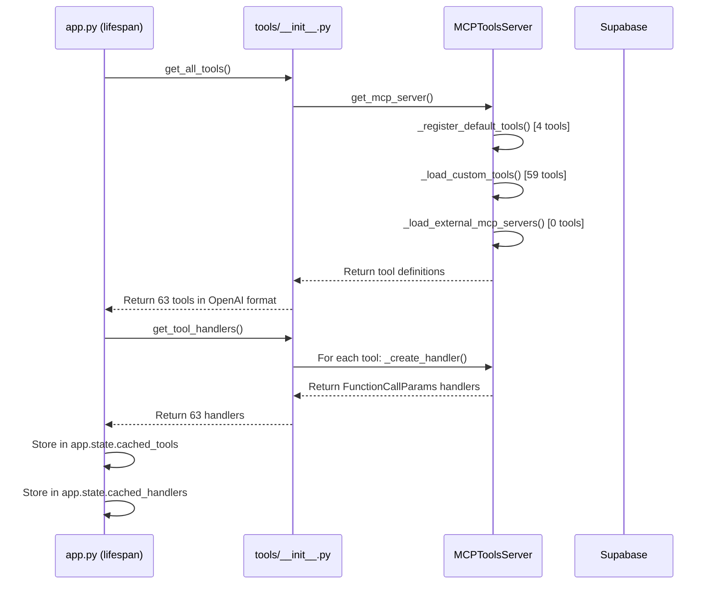
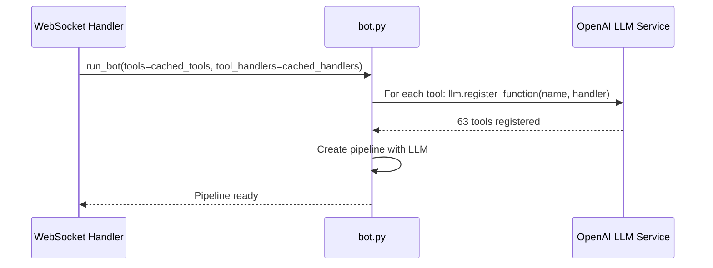
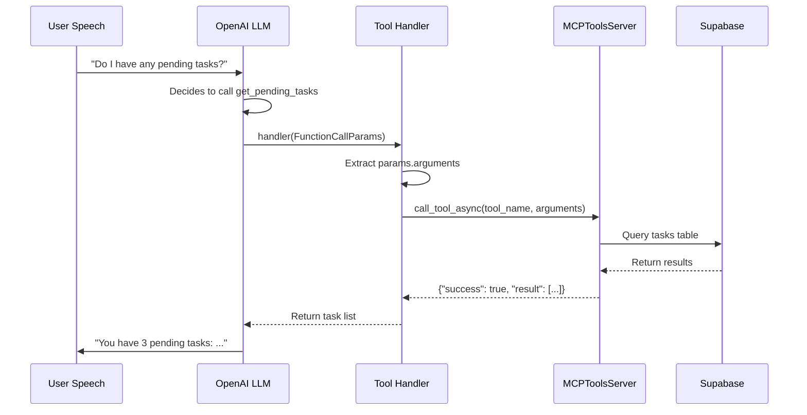

# Voice Agent v5 - Tools Inventory Report

**Generated:** January 12, 2026  
**Total Tools:** 63 tools  
**Tool Categories:** 9 categories

---

## Executive Summary

The Voice Agent v5 system utilizes a comprehensive suite of 63 MCP (Model Context Protocol) tools that enable the LLM to perform various actions during voice conversations. These tools are organized into two main types:

- **Internal Tools (63 tools):** Custom-built tools loaded from Python modules
- **External Tools (0 currently active):** Tools from external MCP servers (capability exists but not in use)

All tools were affected by the recent handler signature fix (FunctionCallParams update) required for Pipecat 0.0.98 compatibility.

---

## Tool Type Classification

### Internal Tools
**Definition:** Tools defined within the Voice Agent codebase, loaded from Python modules in `src/voice_agent/tools/`

**How They Work:**
1. Each tool is defined in a Python file with a `TOOL_DEFINITION` or `TOOL_DEFINITIONS` constant
2. Tools are automatically discovered and loaded at startup by `MCPToolsServer._load_custom_tools()`
3. Each tool has a handler function that executes the actual logic
4. Handlers are wrapped with `FunctionCallParams` signature for Pipecat compatibility

**Loading Process:**
```python
# Server scans src/voice_agent/tools/ directory
# Loads each .py file (except server.py and __init__.py)
# Extracts TOOL_DEFINITION or TOOL_DEFINITIONS
# Registers with MCPToolsServer
```

**Advantages:**
- Full control over implementation
- Direct access to database and services
- No external dependencies or network calls
- Fast execution (local code)

### External Tools
**Definition:** Tools loaded from external MCP servers via `mcp_client` package

**How They Work:**
1. External MCP servers expose tools via the Model Context Protocol
2. Voice Agent connects to these servers via `mcp_client.get_mcp_manager()`
3. Tools are discovered dynamically from external servers
4. Calls are proxied through the MCP client to the external server

**Current Status:** ⚠️ Not currently in use (no external servers configured)

**Potential Use Cases:**
- Third-party integrations
- Microservices-based tool architecture
- Shared tools across multiple agents

---

## Tool Categories & Inventory

### 1️⃣ Built-in System Tools (4 tools)
**Category:** `BUILT_IN`  
**Type:** Internal  
**Source:** `server.py` (hardcoded in `_register_default_tools()`)

| # | Tool Name | Description | Parameters |
|---|-----------|-------------|------------|
| 1 | `get_current_time` | Get the current date and time | None |
| 2 | `calculate` | Perform basic arithmetic calculations | operation, a, b |
| 3 | `get_system_info` | Get system information (OS, Python version) | None |
| 4 | `format_date` | Format a date string in different formats | date_string, format |

**Purpose:** General utility functions for basic operations during conversations.

---

### 2️⃣ CRM Customer Management (6 tools)
**Category:** `CRM_CUSTOMER`  
**Type:** Internal  
**Source:** `crm_customer.py`  
**Database:** Supabase (`customers` table)

| # | Tool Name | Description | Key Parameters |
|---|-----------|-------------|----------------|
| 5 | `get_customer_by_phone` | Retrieve customer by phone number | phone |
| 6 | `get_customer_by_id` | Retrieve customer by ID | customer_id |
| 7 | `create_customer` | Create new customer record | name, phone, email, company |
| 8 | `update_customer_status` | Update customer status | customer_id, status |
| 9 | `update_customer_info` | Update customer information | customer_id, name, email, etc. |
| 10 | `search_customers` | Search customers by name/email | query |

**Purpose:** Core customer data management. The agent uses these to identify callers, create new contacts, and update customer information during calls.

**Critical for:** Customer identification at call start (parallel prefetch optimization).

---

### 3️⃣ CRM Task Management (7 tools)
**Category:** `CRM_TASKS`  
**Type:** Internal  
**Source:** `crm_tasks.py`  
**Database:** Supabase (`tasks` table)

| # | Tool Name | Description | Key Parameters |
|---|-----------|-------------|----------------|
| 11 | `get_pending_tasks` | Get pending tasks for a customer | customer_id |
| 12 | `get_all_pending_tasks` | Get all pending tasks | None |
| 13 | `create_task` | Create a new task | customer_id, title, description, due_date |
| 14 | `complete_task` | Mark a task as complete | task_id |
| 15 | `update_task` | Update task details | task_id, title, description, due_date |
| 16 | `get_overdue_tasks` | Get overdue tasks | customer_id (optional) |
| 17 | `delete_task` | Delete a task | task_id |

**Purpose:** Task and follow-up management. Allows the agent to schedule callbacks, set reminders, and track action items during conversations.

**Use Cases:** 
- "Schedule a follow-up call for next week"
- "Remind me to send the proposal by Friday"
- "What tasks do I have pending for this customer?"

---

### 4️⃣ CRM Knowledge Base (7 tools)
**Category:** `CRM_KNOWLEDGE`  
**Type:** Internal  
**Source:** `crm_knowledge.py`  
**Database:** Supabase (`knowledge_base` table)

| # | Tool Name | Description | Key Parameters |
|---|-----------|-------------|----------------|
| 18 | `search_knowledge_base` | Search knowledge base articles | query |
| 19 | `get_knowledge_by_category` | Get articles by category | category |
| 20 | `get_knowledge_by_id` | Get specific article | knowledge_id |
| 21 | `add_knowledge_item` | Add new knowledge article | title, content, category, tags |
| 22 | `update_knowledge_item` | Update existing article | knowledge_id, title, content, etc. |
| 23 | `delete_knowledge_item` | Delete an article | knowledge_id |
| 24 | `list_categories` | List all knowledge categories | None |

**Purpose:** Product information, FAQs, company policies. The agent queries this to answer customer questions with accurate, pre-approved information.

**Use Cases:**
- "What are your business hours?"
- "Tell me about your pricing plans"
- "What's your return policy?"

---

### 5️⃣ CRM Call Management & History (6 tools)
**Category:** `CRM_CALLS`  
**Type:** Internal  
**Sources:** `crm_calls.py`, `crm_call_management.py`  
**Database:** Supabase (`calls` table)

| # | Tool Name | Description | Key Parameters |
|---|-----------|-------------|----------------|
| 25 | `get_call_history` | Get call history for a customer | customer_id, limit |
| 26 | `get_last_call` | Get the most recent call | customer_id |
| 27 | `save_call_summary` | Save call summary and outcome | customer_id, summary, outcome, etc. |
| 28 | `update_call_transcript` | Update call transcript | call_id, transcript |
| 29 | `get_calls_by_outcome` | Get calls by outcome status | outcome |
| 30 | `end_call` | End the current call gracefully | reason (optional) |

**Purpose:** Call logging, analytics, and graceful call termination. Tracks conversation history and outcomes.

**Use Cases:**
- "What did we discuss last time?"
- "End the call" (customer request)
- Automatic call summary generation

---

### 6️⃣ CRM Scripts & Objection Handling (4 tools)
**Category:** `CRM_SCRIPTS`  
**Type:** Internal  
**Source:** `crm_scripts.py`  
**Database:** Supabase (`call_scripts`, `objection_handlers` tables)

| # | Tool Name | Description | Key Parameters |
|---|-----------|-------------|----------------|
| 31 | `get_call_script` | Get a specific call script | script_type |
| 32 | `get_all_call_scripts` | Get all available call scripts | None |
| 33 | `get_objection_handler` | Get response for specific objection | objection_type |
| 34 | `list_objections` | List all objection types | None |

**Purpose:** Structured conversation guidance. Provides pre-written scripts for common scenarios and objection responses for sales calls.

**Use Cases:**
- Sales calls (opening script, closing script)
- Handling price objections
- Scheduling objections ("I don't have time")

---

### 7️⃣ CRM Customer Facts (5 tools)
**Category:** `CRM_FACTS`  
**Type:** Internal  
**Source:** `crm_facts.py`  
**Database:** Supabase (`customer_facts` table)

| # | Tool Name | Description | Key Parameters |
|---|-----------|-------------|----------------|
| 35 | `get_customer_facts` | Get facts about a customer | customer_id |
| 36 | `add_customer_fact` | Add a fact about a customer | customer_id, fact_type, fact_value |
| 37 | `get_facts_by_type` | Get facts by type | fact_type |
| 38 | `search_customers_by_fact` | Find customers with specific facts | fact_type, fact_value |
| 39 | `delete_customer_fact` | Delete a customer fact | fact_id |

**Purpose:** Store arbitrary key-value data about customers (preferences, notes, special requirements).

**Use Cases:**
- "Customer prefers calls after 2pm"
- "Customer has a pet named Max"
- "Customer is allergic to peanuts" (restaurant context)

---

### 8️⃣ Google Calendar Integration (10 tools)
**Category:** `CALENDAR`  
**Type:** Internal  
**Source:** `google_calendar.py`  
**API:** Google Calendar API  
**Database:** Supabase (`calendar_connections` table for OAuth)

| # | Tool Name | Description | Key Parameters |
|---|-----------|-------------|----------------|
| 40 | `create_calendar_event` | Create a new calendar event | customer_id, summary, start_time, end_time, attendees |
| 41 | `list_upcoming_calendar_events` | List upcoming events | customer_id, max_results |
| 42 | `search_calendar_events` | Search events by query | customer_id, query |
| 43 | `get_calendar_event` | Get specific event details | customer_id, event_id |
| 44 | `update_calendar_event` | Update an existing event | customer_id, event_id, summary, etc. |
| 45 | `cancel_calendar_event` | Cancel/delete an event | customer_id, event_id |
| 46 | `check_calendar_availability` | Check if time slot is free | customer_id, start_time, end_time |
| 47 | `list_calendar_attendees` | List attendees of an event | customer_id, event_id |
| 48 | `get_calendar_availability_for_attendee` | Get attendee's free/busy | customer_id, attendee_email, start_time, end_time |
| 49 | `book_appointment` | High-level appointment booking | customer_id, title, start_time, duration, attendee_email |

**Purpose:** Full calendar management. The agent can schedule appointments, check availability, and manage events during calls.

**Use Cases:**
- "Schedule a meeting for next Tuesday at 2pm"
- "Am I free tomorrow afternoon?"
- "Cancel my 3pm appointment"

---

### 9️⃣ Communication Tools (13 tools)
**Category:** `COMMUNICATION`  
**Type:** Internal  
**Sources:** `email.py`, `whatsapp.py`, `whatsapp_evolution.py`, `communication_status.py`, `weather.py`

#### Email Tools (4 tools) - `email.py`
| # | Tool Name | Description | Key Parameters |
|---|-----------|-------------|----------------|
| 50 | `send_email` | Send a plain text email | to_email, subject, body |
| 51 | `send_html_email` | Send an HTML email | to_email, subject, html_body |
| 52 | `send_bulk_email` | Send email to multiple recipients | recipient_list, subject, body |
| 53 | `send_email_template` | Send using a template | to_email, template_name, template_vars |

#### WhatsApp Tools (8 tools) - `whatsapp.py` / `whatsapp_evolution.py`
**Backend:** Evolution API (configured via `WHATSAPP_BACKEND=evolution`)

| # | Tool Name | Description | Key Parameters |
|---|-----------|-------------|----------------|
| 54 | `send_whatsapp_message` | Send text message | phone, message |
| 55 | `send_whatsapp_image` | Send image with caption | phone, image_url, caption |
| 56 | `send_whatsapp_video` | Send video with caption | phone, video_url, caption |
| 57 | `send_whatsapp_document` | Send document file | phone, document_url, filename |
| 58 | `send_whatsapp_audio` | Send audio file | phone, audio_url |
| 59 | `send_whatsapp_generated_audio` | Send TTS-generated audio | phone, text |
| 60 | `send_whatsapp_location` | Send location pin | phone, latitude, longitude, name |
| 61 | `send_whatsapp_template` | Send WhatsApp Business template | phone, template_name, template_vars |

#### Other Communication Tools (2 tools)
| # | Tool Name | Description | Source File |
|---|-----------|-------------|-------------|
| 62 | `get_communication_status` | Check if services are operational | communication_status.py |
| 63 | `get_weather` | Get weather information for a city | weather.py |

**Purpose:** Multi-channel outreach. The agent can send follow-up messages, confirmations, and content via email and WhatsApp during or after calls.

**Use Cases:**
- "Send me the proposal via email"
- "Text me the address on WhatsApp"
- "Send a confirmation message"

---

## Tool Loading Architecture

### Startup Sequence (Pre-initialization Phase)



### Per-Call Tool Registration



### Tool Call Execution



---

## Recent Critical Fix: FunctionCallParams

### The Problem
**Date:** January 12, 2026  
**Impact:** ALL 63 tools were broken

The tool handlers were using the wrong signature:
```python
# ❌ OLD (BROKEN)
async def handler(**kwargs):
    result = await server.call_tool_async(tool_name, kwargs)
```

Pipecat expects handlers to accept a single `FunctionCallParams` object:
```python
@dataclass
class FunctionCallParams:
    function_name: str
    tool_call_id: str
    arguments: Mapping[str, Any]  # ← The actual parameters
    llm: LLMService
    context: OpenAILLMContext
    result_callback: FunctionCallResultCallback
```

### The Fix
**Files Modified:**
1. `src/voice_agent/tools/__init__.py` - Internal tools handler
2. `src/voice_agent/tools/server.py` - External MCP tools handler

```python
# ✅ NEW (FIXED)
async def handler(params: "FunctionCallParams"):
    """Handler that accepts Pipecat FunctionCallParams."""
    result = await server.call_tool_async(tool_name, params.arguments)
```

**Status:** ✅ Fixed as of 2026-01-12 15:08

---

## Performance Optimizations

### Phase 1: Eager Tool Loading (Implemented)
**Config Flag:** `EAGER_TOOL_LOADING=True` (default)

**Before:**
- Tools loaded on first call: ~800ms per call

**After:**
- Tools pre-loaded at startup: 844.1ms (one-time cost)
- Per-call overhead: ~0ms (use cached tools)

**Savings:** 800ms per call after the first call

### Phase 2: Tool Handler Caching (Implemented)
**Storage:** `app.state.cached_tools` and `app.state.cached_handlers`

**Before:**
- Create tool handlers on every call: ~50-100ms

**After:**
- Handlers created once at startup
- Reused for all calls via `tools` and `tool_handlers` parameters

**Savings:** 50-100ms per call

---

## Tool Usage Patterns

### Essential Tools (Used on Most Calls)
These tools are critical for basic operations and are likely to be called frequently:

1. **`get_customer_by_phone`** - Customer identification (parallel prefetch)
2. **`get_current_time`** - Date/time references
3. **`end_call`** - Graceful call termination
4. **`save_call_summary`** - Call logging

### Common Tools (Frequently Used)
5. **`create_task`** - Follow-up scheduling
6. **`get_pending_tasks`** - Task review
7. **`search_knowledge_base`** - Information retrieval
8. **`create_calendar_event`** - Appointment booking
9. **`send_whatsapp_message`** - Follow-up messaging
10. **`send_email`** - Document sending

### Specialized Tools (Context-Dependent)
- **Calendar tools:** Used in scheduling contexts
- **WhatsApp tools:** Used when customer prefers WhatsApp
- **Email tools:** Used for formal communication
- **Script tools:** Used in sales/support contexts
- **Objection handlers:** Used in sales contexts

---

## Database Schema Dependencies

### Supabase Tables Used
| Table | Tools Using It | Purpose |
|-------|----------------|---------|
| `customers` | 6 customer tools | Customer master data |
| `tasks` | 7 task tools | Task management |
| `knowledge_base` | 7 knowledge tools | Knowledge articles |
| `calls` | 5 call tools | Call history & transcripts |
| `call_scripts` | 2 script tools | Conversation templates |
| `objection_handlers` | 2 objection tools | Sales objection responses |
| `customer_facts` | 5 fact tools | Customer metadata |
| `calendar_connections` | 10 calendar tools | OAuth tokens for Google Calendar |

### External APIs Used
| Service | Tools | Purpose |
|---------|-------|---------|
| Google Calendar API | 10 calendar tools | Event management |
| Evolution API | 8 WhatsApp tools | WhatsApp messaging |
| SMTP Server | 4 email tools | Email sending |
| Weather API | 1 weather tool | Weather information |

---

## Future Tool Expansion

### Potential Internal Tools
- **CRM Opportunities:** Deal tracking, pipeline management
- **CRM Quotes:** Quote generation and tracking
- **CRM Campaigns:** Campaign tracking and attribution
- **Analytics:** Call metrics, conversion tracking
- **SMS Tools:** SMS messaging (alternative to WhatsApp)
- **Payment Tools:** Payment link generation, payment status

### Potential External MCP Tools
If external MCP servers were configured, the system could integrate:
- **Third-party CRMs:** Salesforce, HubSpot tools
- **Project Management:** Asana, Trello, Jira tools
- **eCommerce:** Shopify, WooCommerce tools
- **Support Tickets:** Zendesk, Freshdesk tools
- **Financial Tools:** Stripe, PayPal, QuickBooks

**Architecture Support:** The system already has `_load_external_mcp_servers()` implemented, ready to load external tools via `mcp_client`.

---

## Configuration

### Environment Variables
Key configurations affecting tools:

```bash
# WhatsApp Backend Selection
WHATSAPP_BACKEND=evolution  # or "twilio"

# Calendar Integration
GOOGLE_CALENDAR_ENABLED=true

# Email Configuration
SMTP_HOST=smtp.gmail.com
SMTP_PORT=587

# Database
SUPABASE_URL=https://your-project.supabase.co
SUPABASE_KEY=your-key

# Tool Loading
EAGER_TOOL_LOADING=true  # Pre-load tools at startup
```

### Feature Flags
```python
# config.py
eager_tool_loading: bool = True  # Pre-load tools
direct_greeting_injection: bool = True  # Fast greeting
parallel_context_prefetch: bool = True  # Non-blocking customer fetch
```

---

## Testing & Validation

### Test Coverage
**Status:** 163/163 tests passing ✅

**Test Categories:**
- Unit tests for individual tools
- Integration tests with Supabase
- End-to-end Pipecat integration tests
- Tool handler signature validation

### Known Issues
- ✅ **FIXED:** Tool handler signature (FunctionCallParams)
- ✅ **FIXED:** Call startup latency (pre-initialization)

---

## Glossary

**MCP (Model Context Protocol):** Standard protocol for exposing tools/functions to LLMs

**Internal Tools:** Tools defined within the Voice Agent codebase

**External Tools:** Tools loaded from external MCP servers (not currently in use)

**Tool Handler:** The async function that executes when the LLM calls a tool

**FunctionCallParams:** Pipecat's standard parameter object passed to tool handlers

**Eager Loading:** Pre-loading tools at application startup rather than per-call

**Tool Caching:** Storing tool definitions and handlers in `app.state` for reuse

**Parallel Prefetch:** Loading customer context in background while greeting plays

---

## Document Metadata

**Version:** 1.0  
**Last Updated:** January 12, 2026  
**Author:** AI Assistant (GitHub Copilot)  
**Related Documents:**
- `CALL_STARTUP_LATENCY_ANALYSIS.md` - Performance optimization analysis
- `docs/project_master_guide.md` - Overall system architecture
- `src/voice_agent/tools/README.md` - Tool development guide (if exists)

**Change History:**
- 2026-01-12: Initial report creation
- 2026-01-12: Added FunctionCallParams fix details
- 2026-01-12: Added performance optimization metrics
