# Triple-Hybrid-RAG Architecture Diagrams

> **Visual representations of all system components using Mermaid**

## Table of Contents
1. [System Overview](#1-system-overview)
2. [Ingestion Pipeline](#2-ingestion-pipeline)
3. [Retrieval Pipeline](#3-retrieval-pipeline)
4. [Triple-Hybrid Search](#4-triple-hybrid-search)
5. [HyDE Generation](#5-hyde-generation)
6. [Query Expansion](#6-query-expansion)
7. [Multi-Stage Reranking](#7-multi-stage-reranking)
8. [Self-RAG Flow](#8-self-rag-flow)
9. [Corrective RAG Flow](#9-corrective-rag-flow)
10. [Agentic RAG Flow](#10-agentic-rag-flow)
11. [Database Schema](#11-database-schema)
12. [Infrastructure](#12-infrastructure)

---

## 1. System Overview

```mermaid
flowchart TB
    subgraph INGESTION["📥 INGESTION PIPELINE"]
        direction LR
        D[Documents] --> L[Loaders]
        L --> C[Chunking]
        C --> E[Embedding]
        E --> NER[Entity Extraction]
        NER --> DB[(Database)]
    end
    
    subgraph RETRIEVAL["🔍 RETRIEVAL PIPELINE"]
        direction LR
        Q[Query] --> QP[Query Processing]
        QP --> HYDE[HyDE]
        HYDE --> EXP[Expansion]
        EXP --> SEARCH[Triple-Hybrid Search]
        SEARCH --> FUSION[RRF Fusion]
        FUSION --> RERANK[Multi-Stage Rerank]
        RERANK --> DIV[Diversity]
        DIV --> RESULTS[Results]
    end
    
    subgraph ADVANCED["🧠 ADVANCED RAG"]
        direction LR
        SELF[Self-RAG]
        CRAG[Corrective RAG]
        AGENT[Agentic RAG]
    end
    
    INGESTION --> DB
    DB --> RETRIEVAL
    RETRIEVAL --> ADVANCED
    
    style INGESTION fill:#e1f5fe
    style RETRIEVAL fill:#f3e5f5
    style ADVANCED fill:#e8f5e9
```



---

## 2. Ingestion Pipeline

```mermaid
flowchart TB
    subgraph INPUT["📄 Document Input"]
        PDF[PDF Files]
        DOCX[Word Docs]
        TXT[Text Files]
        IMG[Images]
    end
    
    subgraph LOADING["🔄 Loading"]
        PARSER[Document Parser]
        OCR[OCR Engine]
    end
    
    subgraph CHUNKING["✂️ Chunking"]
        HIER[Hierarchical Chunker]
        SEM[Semantic Chunker]
        
        subgraph PARENT["Parent Chunks"]
            P1[800-1000 tokens]
            P2[Full context]
        end
        
        subgraph CHILD["Child Chunks"]
            C1[~200 tokens]
            C2[Embedded]
            C3[Indexed]
        end
    end
    
    subgraph EMBEDDING["🔢 Embedding"]
        QWEN[Qwen3-VL-2B]
        MAT[Matryoshka 2048→1024]
        BATCH[Concurrent Batching]
    end
    
    subgraph NER["🏷️ Entity Extraction"]
        GPT[GPT-5 NER/RE]
        ENT[Entities]
        REL[Relations]
    end
    
    subgraph STORAGE["💾 Storage"]
        PG[(PostgreSQL)]
        VEC[pgvector HNSW]
        GRAPH[PuppyGraph]
    end
    
    INPUT --> LOADING
    LOADING --> CHUNKING
    CHUNKING --> EMBEDDING
    EMBEDDING --> NER
    NER --> STORAGE
    
    PDF --> PARSER
    IMG --> OCR
    
    HIER --> PARENT
    HIER --> CHILD
    
    QWEN --> MAT
    
    GPT --> ENT
    GPT --> REL
    
    PG --> VEC
    PG --> GRAPH
    
    style INPUT fill:#fff3e0
    style LOADING fill:#e3f2fd
    style CHUNKING fill:#f1f8e9
    style EMBEDDING fill:#fce4ec
    style NER fill:#e8eaf6
    style STORAGE fill:#e0f2f1
```



---

## 3. Retrieval Pipeline

```mermaid
flowchart TB
    USER[👤 User Query] --> QP[Query Processor]
    
    subgraph QUERY_ENHANCEMENT["🎯 Query Enhancement"]
        QP --> INTENT[Intent Detection]
        INTENT --> HYDE[HyDE Generation]
        HYDE --> EXPAND[Query Expansion]
    end
    
    subgraph TRIPLE_SEARCH["🔎 Triple-Hybrid Search"]
        direction TB
        EXPAND --> LEX[Lexical BM25]
        EXPAND --> SEM[Semantic HNSW]
        EXPAND --> GRA[Graph Cypher]
    end
    
    subgraph FUSION_RANK["⚖️ Fusion & Ranking"]
        LEX --> RRF[RRF Fusion]
        SEM --> RRF
        GRA --> RRF
        
        RRF --> R1[Stage 1: Bi-encoder]
        R1 --> R2[Stage 2: Cross-encoder]
        R2 --> R3[Stage 3: MMR Diversity]
        R3 --> R4[Stage 4: Business Rules]
    end
    
    subgraph POST_PROCESS["✨ Post-Processing"]
        R4 --> COMPRESS[Context Compression]
        COMPRESS --> DIVERSE[Source Diversity]
        DIVERSE --> CACHE[Cache Result]
    end
    
    CACHE --> RESULTS[📋 Top-K Results]
    
    style QUERY_ENHANCEMENT fill:#e8f5e9
    style TRIPLE_SEARCH fill:#fff3e0
    style FUSION_RANK fill:#e3f2fd
    style POST_PROCESS fill:#fce4ec
```



---

## 4. Triple-Hybrid Search


---

## 5. HyDE Generation


---

## 6. Query Expansion


---

## 7. Multi-Stage Reranking

```mermaid
flowchart TB
    INPUT[100 Candidates] --> S1
    
    subgraph S1["Stage 1: Fast Scoring"]
        BI[Bi-encoder]
        FAST[Pre-computed Embeddings]
        BI --> FAST
    end
    
    S1 -->|Top 50| S2
    
    subgraph S2["Stage 2: Deep Scoring"]
        CROSS[Cross-encoder]
        JOINT[Joint Query-Doc Processing]
        CROSS --> JOINT
    end
    
    S2 -->|Top 20| S3
    
    subgraph S3["Stage 3: Diversity"]
        MMR[Maximal Marginal Relevance]
        LAMBDA[λ = 0.7]
        MMR --> LAMBDA
    end
    
    S3 -->|Top 15| S4
    
    subgraph S4["Stage 4: Business Rules"]
        RECENT[Boost Recent]
        VERIFIED[Boost Verified]
        QUALITY[Quality Filters]
    end
    
    S4 --> OUTPUT[Top 10 Results]
    
    style S1 fill:#e8f5e9
    style S2 fill:#e3f2fd
    style S3 fill:#fff8e1
    style S4 fill:#fce4ec
```



---

## 8. Self-RAG Flow


---

## 9. Corrective RAG Flow

```mermaid
flowchart TB
    Q[Query] --> INITIAL[Initial Retrieval]
    
    INITIAL --> EVAL
    
    subgraph EVAL["📊 Knowledge Assessment"]
        direction LR
        DOC1[Doc 1]
        DOC2[Doc 2]
        DOC3[Doc 3]
        
        DOC1 --> A1{Assess}
        DOC2 --> A2{Assess}
        DOC3 --> A3{Assess}
    end
    
    subgraph CATEGORIZE["🏷️ Categorization"]
        CORRECT[✅ Correct]
        AMBIG[❓ Ambiguous]
        WRONG[❌ Incorrect]
    end
    
    A1 --> CORRECT
    A2 --> AMBIG
    A3 --> WRONG
    
    CORRECT --> USE[Use As-Is]
    AMBIG --> AUGMENT[Augment with Web Search]
    WRONG --> REPLACE[Replace with Web Search]
    
    subgraph REFINE["🔧 Knowledge Refinement"]
        DECOMPOSE[Decompose Docs]
        FILTER[Filter Irrelevant]
        REORDER[Reorder by Relevance]
    end
    
    USE --> REFINE
    AUGMENT --> REFINE
    REPLACE --> REFINE
    
    REFINE --> GEN[Generate Answer]
    GEN --> ANSWER[Final Answer]
    
    style EVAL fill:#e3f2fd
    style CATEGORIZE fill:#fff8e1
    style REFINE fill:#e8f5e9
```



---

## 10. Agentic RAG Flow

```mermaid
flowchart TB
    Q[Complex Query] --> AGENT
    
    subgraph AGENT["🤖 ReAct Agent Loop"]
        direction TB
        
        subgraph ITER1["Iteration 1"]
            T1[Thought: Need Q1 data]
            A1[Action: search Q1 revenue]
            O1[Observation: Found 3 docs]
        end
        
        subgraph ITER2["Iteration 2"]
            T2[Thought: Need Q4 data]
            A2[Action: search Q4 revenue]
            O2[Observation: Found 2 docs]
        end
        
        subgraph ITER3["Iteration 3"]
            T3[Thought: Calculate totals]
            A3[Action: calculate revenues]
            O3[Observation: Q1=$5M, Q4=$4M]
        end
    end
    
    subgraph TOOLS["🛠️ Available Tools"]
        SEARCH[🔍 Search Tool]
        CALC[🧮 Calculate Tool]
        SQL[📊 SQL Tool]
        WEB[🌐 Web Tool]
    end
    
    A1 --> SEARCH
    A2 --> SEARCH
    A3 --> CALC
    
    ITER1 --> ITER2 --> ITER3
    
    ITER3 --> FINAL{Final Answer?}
    FINAL -->|Yes| ANSWER[📋 Final Answer]
    FINAL -->|No| ITER1
    
    style ITER1 fill:#e8f5e9
    style ITER2 fill:#e3f2fd
    style ITER3 fill:#fff8e1
    style TOOLS fill:#f3e5f5
```



---

## 11. Database Schema


---

## 12. Infrastructure

```mermaid
flowchart TB
    subgraph DOCKER["🐳 Docker Compose"]
        subgraph PG["PostgreSQL + pgvector"]
            PGDB[(rag_db)]
            HNSW[HNSW Index]
            GIN[GIN Index]
            PGDB --> HNSW
            PGDB --> GIN
        end
        
        subgraph PUPPY["PuppyGraph"]
            BOLT[Bolt Protocol :7697]
            WEB[Web UI :8091]
        end
        
        PG --> PUPPY
    end
    
    subgraph VLLM["🚀 vLLM Services"]
        subgraph EMBED["Embedding Service :1234"]
            QWEN[Qwen3-VL-Embedding-2B]
        end
        
        subgraph RERANK["Reranking Service :1235"]
            QWENR[Qwen3-Reranker-2B]
        end
    end
    
    subgraph APP["📱 Application"]
        RAG[Triple-Hybrid-RAG]
        CONFIG[Config .env]
    end
    
    APP --> DOCKER
    APP --> VLLM
    
    style DOCKER fill:#e3f2fd
    style VLLM fill:#f3e5f5
    style APP fill:#e8f5e9
```



---

## 13. RRF Fusion Algorithm


---

## 14. MMR Diversity Algorithm

```mermaid
flowchart TB
    INPUT[Reranked Candidates] --> INIT
    
    INIT["Initialize: Selected = empty"] --> LOOP
    
    subgraph LOOP["MMR Selection Loop"]
        direction TB
        
        CALC["For each candidate c:<br/>MMR = λ × Relevance - (1-λ) × max Sim"]
        
        SELECT["Select argmax MMR"]
        ADD["Add to Selected"]
        
        CALC --> SELECT --> ADD
    end
    
    ADD --> CHECK{"Selected count < k?"}
    CHECK -->|Yes| CALC
    CHECK -->|No| OUTPUT
    
    OUTPUT[Diverse Top-K Results]
    
    subgraph PARAMS["Parameters"]
        LAMBDA["λ = 0.7"]
        TOPK["k = 10"]
    end
    
    style LOOP fill:#e8f5e9
    style PARAMS fill:#fff8e1
```



---

## 15. Hierarchical Chunking Structure

```mermaid
flowchart TB
    DOC[Document] --> SPLIT
    
    subgraph SPLIT["Document Splitting"]
        direction TB
        
        subgraph P1["Parent Chunk 1 (800-1000 tokens)"]
            PC1[Full Context for LLM]
            
            subgraph CHILDREN1["Child Chunks (~200 tokens each)"]
                C1[Child 1 - Embedded ✓]
                C2[Child 2 - Embedded ✓]
                C3[Child 3 - Embedded ✓]
            end
        end
        
        subgraph P2["Parent Chunk 2 (800-1000 tokens)"]
            PC2[Full Context for LLM]
            
            subgraph CHILDREN2["Child Chunks (~200 tokens each)"]
                C4[Child 4 - Embedded ✓]
                C5[Child 5 - Embedded ✓]
            end
        end
    end
    
    subgraph RETRIEVAL["Retrieval Process"]
        QUERY[Query] --> SEARCH_CHILD[Search Child Chunks]
        SEARCH_CHILD --> MATCH[Match: Child 2]
        MATCH --> RETURN_PARENT[Return: Parent 1]
    end
    
    C2 -.-> MATCH
    P1 -.-> RETURN_PARENT
    
    style P1 fill:#e3f2fd
    style P2 fill:#e3f2fd
    style CHILDREN1 fill:#e8f5e9
    style CHILDREN2 fill:#e8f5e9
    style RETRIEVAL fill:#fff8e1
```



---

## 16. Complete Data Flow


---

## How to Render These Diagrams

### Option 1: GitHub
GitHub natively renders Mermaid diagrams in Markdown files.

### Option 2: VS Code
Install the "Markdown Preview Mermaid Support" extension.

### Option 3: Online
Use [Mermaid Live Editor](https://mermaid.live/) to render and export.

### Option 4: CLI
```bash
npm install -g @mermaid-js/mermaid-cli
mmdc -i docs/diagrams/ARCHITECTURE_DIAGRAMS.md -o docs/diagrams/output.png
```

---

*Generated: January 2026*
