# Voice Agent v4 - Project Master Guide

> [!NOTE]
> This document serves as the **single source of truth** for the `voice_agent_v4` architecture, implementation details, and operational guide. It is intended for developers and system architects requiring deep technical insight.

---

## 1. Project Overview

**Voice Agent v4** is a high-performance, asynchronous AI voice assistant designed for real-time customer interaction via telephony (Twilio) and omnichannel messaging. It acts as a conversational interface for a CRM system, capable of identifying customers, managing tasks, logging calls, and providing knowledge base answers with <800ms latency.

---

## 2. System Architecture

### 2.1 High-Level Architecture

The system follows a **Hexagonal Architecture (Ports & Adapters)** pattern.

> [!TIP]
> **Diagram Orientation**: Top-down flow from External Services (Sources) to Core Logic, then branching to Tools and Adapters.


### 2.2 Core Domain (The Actor) & Event Loop

The core logic resides in [voice_agent_v4/actor.py](file:///home/matheus/repos/agno_cartesia/voice_agent_v4/actor.py). The [SessionActor](file:///home/matheus/repos/agno_cartesia/voice_agent_v4/actor.py#74-1523) is not just a simple state container; it is an active **Event Loop Orchestrator**.

#### The Priority Queue Mechanism

The Actor runs a custom `asyncio.PriorityQueue` loop. Every input (audio, network, internal timer) is converted into an [Event](file:///home/matheus/repos/agno_cartesia/voice_agent_v4/communication/storage.py#19-30) object and pushed to this queue.
The queue sorts events based on a [priority_tuple](file:///home/matheus/repos/agno_cartesia/voice_agent_v4/actor.py#214-222) (Turn ID, Priority Level, Sequence Number), ensuring that critical signals (like Barge-In) are processed *before* non-critical ones (like LLM tokens), even if the LLM token arrived first in the buffer.

```mermaid
graph TD
    classDef p0 fill:#ffebee,stroke:#c62828,stroke-width:2px,color:black;
    classDef p1 fill:#fff3e0,stroke:#ef6c00,stroke-width:2px,color:black;
    classDef p2 fill:#fffde7,stroke:#fbc02d,stroke-width:2px,color:black;
    classDef p3 fill:#e8f5e9,stroke:#2e7d32,stroke-width:2px,color:black;

    subgraph Queue["Priority Queue (Lower = Higher Priority)"]
        P0["🔴 Priority 0: VAD Events<br/>(speech_start, speech_end)"]:::p0
        P1["🟠 Priority 1: STT Events<br/>(partial, final)"]:::p1
        P2["🟡 Priority 2: Control Events<br/>(tool_output, cancel)"]:::p2
        P3["🟢 Priority 3: LLM Events<br/>(token, done)"]:::p3
    end
    
    P0 --> P1 --> P2 --> P3
```



#### State Machine & Barge-In Logic

The state machine (`states/`) manages logical modes. Crucially, it implements **Barge-In**—the ability for the user to interrupt the agent.

1. **State is SPEAKING**: Agent is streaming TTS audio.
2. **User Speaks**: VAD detects voice -> Fires `VAD_SPEECH_START` (Priority 0).
3. **Actor Interrupts**:
    * [SessionActor](file:///home/matheus/repos/agno_cartesia/voice_agent_v4/actor.py#74-1523) sees Priority 0 event.
    * Calls `self._tts_cancel.cancel()` -> Stops TTS stream instantly.
    * Calls `self._llm_task.cancel()` -> Stops remaining generation.
    * Transitions immediately to `LISTENING`.
4. **Result**: The agent shuts up instantly to listen.


### 2.3 Adapters (Providers)

Providers abstract external API interactions.

* **LLM Adapter** ([providers/openai_adapter.py](file:///home/matheus/repos/agno_cartesia/voice_agent_v4/providers/openai_adapter.py)):
  * **Provider**: OpenAI (GPT-4o) via `AsyncOpenAI` client.
  * **Endpoints**: Uses `/v1/chat/completions` with `stream=True`.
  * **Usage**: Manages the system prompt cache (reloaded on file change), handles tool calling loop (pausing generation -> running tool -> submitting result), and injects "sentinel tokens" for silent tools.
* **TTS Adapter** ([providers/cartesia_adapter.py](file:///home/matheus/repos/agno_cartesia/voice_agent_v4/providers/cartesia_adapter.py)):
  * **Provider**: Cartesia (Sonic).
  * **Protocol**: Secure WebSockets (`wss://api.cartesia.ai/...`).
  * **Optimization - Persistence**: Uses a [TTSSession](file:///home/matheus/repos/agno_cartesia/voice_agent_v4/providers/cartesia_adapter.py#298-677) object that keeps the WebSocket open across turns.
  * **Optimization - Pre-warming**: The Actor triggers [_prewarm_tts_session()](file:///home/matheus/repos/agno_cartesia/voice_agent_v4/actor.py#807-832) as soon as the *first* LLM token arrives, even before a full sentence is formed. This covers the TCP/TLS handshake latency (~200ms) while the sentence is still being assembled.
* **STT Adapter** (`providers/deepgram_adapter.py`):
  * **Provider**: Deepgram (via Twilio Media Streams or direct WS). (OR Cartesia Ink Whisper if configured).
  * **Format**: 8kHz Mu-Law (standard telephony).
  * **Implementation**: A dedicated [SttClient](file:///home/matheus/repos/agno_cartesia/voice_agent_v4/core/stt.py#30-37) wraps the Cartesia WebSocket.
  * **Auto-Flush**: Implements an [_auto_flush_loop](file:///home/matheus/repos/agno_cartesia/voice_agent_v4/core/stt.py#172-200) that forces a "Final" transcript if the user pauses for `stt_auto_flush_seconds` (default 1.0s), ensuring we don't wait forever for punctuation.

### 2.4 Infrastructure & Topology

The system is containerized for easy deployment.

```mermaid
graph TD
    classDef container fill:#e3f2fd,stroke:#1565c0,stroke-width:2px,color:black
    classDef vol fill:#fff9c4,stroke:#fbc02d,stroke-width:2px,color:black
    classDef net fill:#f5f5f5,stroke:#9e9e9e,stroke-width:2px,color:black

    subgraph DockerHost["🐳 Docker Host"]
        subgraph Net["Bridge Network: monitoring"]
            VA["voice_agent<br/>(App + API)<br/>Port: 8000"]:::container
            PROM["prometheus<br/>(Metrics Scraper)<br/>Port: 9090"]:::container
            GRAF["grafana<br/>(Dashboards)<br/>Port: 3030"]:::container
        end
        
        subgraph Storage["💾 Persistent Storage"]
            V1[("prometheus_data")]:::vol
            V2[("grafana_data")]:::vol
        end
    end

    VA -- Scrape Target --> PROM
    PROM -- Query Source --> GRAF
    PROM -.-> V1
    GRAF -.-> V2
```



* **Docker**: Base Image `python:3.13-slim`, runs as non-root `appuser`.
* **Healthcheck**: `curl http://localhost:8000/healthz`.

---

## 3. Data Flow & Logic Deep Dive

### 3.1 Async Implementation & Streaming

The system relies heavily on Python's `asyncio` for non-blocking I/O.

#### Audio Processing Sequence

```mermaid
sequenceDiagram
    autonumber
    participant T as Twilio
    participant S as Sink
    participant V as VAD
    participant STT as STT
    participant A as Actor
    participant LLM as OpenAI
    participant TTS as Cartesia

    T->>S: media (µ-law audio)
    S->>V: process(frame)
    
    alt Speech Detected
        V->>A: VadEvent(speech_start)
        A->>STT: start()
        
        loop While Speaking
            S->>STT: audio_chunk
            STT-->>A: SttPartial
        end
        
        V->>A: VadEvent(speech_end)
        STT->>A: SttFinal(transcript)
    end

    A->>LLM: chat.completions.create()
    
    loop Stream Tokens
        LLM-->>A: token
        A->>A: buffer_sentence()
        
        alt Sentence Complete
            A->>TTS: send_text(sentence)
            TTS-->>A: audio_chunk
            A->>S: queue_audio()
            S->>T: media
        end
    end
```



### 3.2 Voice Activity Detection (VAD)

We support multiple modular VAD backends, ensuring flexibility.

| Backend | Implementation File | Characteristics | Use Case |
| :--- | :--- | :--- | :--- |
| **Silero V4** (Default) | [backends/silero_backend.py](file:///home/matheus/repos/agno_cartesia/voice_agent_v4/vad_modular/backends/silero_backend.py) | Neural network based. High accuracy, robust to noise. | **Primary choice.** Best for general production usage. |
| **TEN VAD** | [backends/ten_backend.py](file:///home/matheus/repos/agno_cartesia/voice_agent_v4/vad_modular/backends/ten_backend.py) | Implementation of TEN Framework VAD. | Alternative neural option. |
| **Hysteresis** | [legacy.py](file:///home/matheus/repos/agno_cartesia/voice_agent_v4/vad_modular/legacy.py) | Classic energy-based algorithm (Legacy). Extremely fast (CPU efficient) but less accurate in noise. | **Fallback.** Use on very constrained hardware or for debugging. |

#### Tuning Parameters

* `threshold` (`0.5`): Probability cutoff. Higher = fewer false positives.
* `min_silence_ms` (`120ms`): "Hangover" time. Shorter = faster turn-taking.
* `window_size_ms` (`30ms`): Frame sizing.

---

## 4. Tool Inventory

This section details every tool available to the agent.
**Legend:**

* **Type**: Category of tool.
* **Execution**: **Sync** (Blocks thread/process until done) or **Async Dispatch** (Returns immediately, runs in background).
* **Silent**: **Yes** means the tool output is hidden from the user (agent doesn't "say" the result).
* **DB Access**: Read (R) / Write (W) to specific tables.

### 4.1 Tool Categories Map


### 4.2 CRM Customer Tools (`mcp_tools.crm_customer`)

| Tool Name | Description | Execution | Silent? | DB Access |
| :--- | :--- | :--- | :--- | :--- |
| [get_customer_by_phone](file:///home/matheus/repos/agno_cartesia/voice_agent_v4/mcp_tools/crm_customer.py#27-69) | Identifies caller by phone number. | Sync | No | **R**: [customers](file:///home/matheus/repos/agno_cartesia/voice_agent_v4/mcp_tools/crm_customer.py#319-363), `organizations` |
| [get_customer_by_id](file:///home/matheus/repos/agno_cartesia/voice_agent_v4/mcp_tools/crm_customer.py#71-102) | Refetches profile by UUID. | Sync | No | **R**: [customers](file:///home/matheus/repos/agno_cartesia/voice_agent_v4/mcp_tools/crm_customer.py#319-363) |
| [create_customer](file:///home/matheus/repos/agno_cartesia/voice_agent_v4/mcp_tools/crm_customer.py#104-188) | Creates a new customer record. | Sync | No | **R**: `organizations`, **W**: [customers](file:///home/matheus/repos/agno_cartesia/voice_agent_v4/mcp_tools/crm_customer.py#319-363) |
| [update_customer_status](file:///home/matheus/repos/agno_cartesia/voice_agent_v4/mcp_tools/crm_customer.py#190-237) | Updates pipeline status. | Sync | No | **W**: [customers](file:///home/matheus/repos/agno_cartesia/voice_agent_v4/mcp_tools/crm_customer.py#319-363) |
| [update_customer_info](file:///home/matheus/repos/agno_cartesia/voice_agent_v4/mcp_tools/crm_customer.py#239-317) | Updates fields (email, company). | Sync | No | **W**: [customers](file:///home/matheus/repos/agno_cartesia/voice_agent_v4/mcp_tools/crm_customer.py#319-363) |
| [search_customers](file:///home/matheus/repos/agno_cartesia/voice_agent_v4/mcp_tools/crm_customer.py#319-363) | Fuzzy search by name/email. | Sync | No | **R**: [customers](file:///home/matheus/repos/agno_cartesia/voice_agent_v4/mcp_tools/crm_customer.py#319-363) |

### 4.3 CRM Facts (Memory) (`mcp_tools.crm_facts`)

| Tool Name | Description | Execution | Silent? | DB Access |
| :--- | :--- | :--- | :--- | :--- |
| [get_customer_facts](file:///home/matheus/repos/agno_cartesia/voice_agent_v4/mcp_tools/crm_facts.py#26-106) | Retrives long-term memory. | Sync | Yes* | **R**: [customer_facts](file:///home/matheus/repos/agno_cartesia/voice_agent_v4/mcp_tools/crm_facts.py#26-106) |
| [add_customer_fact](file:///home/matheus/repos/agno_cartesia/voice_agent_v4/mcp_tools/crm_facts.py#108-208) | Learns a new fact. | Sync | Yes | **R**: [customers](file:///home/matheus/repos/agno_cartesia/voice_agent_v4/mcp_tools/crm_customer.py#319-363), **W**: [customer_facts](file:///home/matheus/repos/agno_cartesia/voice_agent_v4/mcp_tools/crm_facts.py#26-106) |
| [get_facts_by_type](file:///home/matheus/repos/agno_cartesia/voice_agent_v4/mcp_tools/crm_facts.py#210-254) | Filters facts (e.g., 'pain_point'). | Sync | No | **R**: [customer_facts](file:///home/matheus/repos/agno_cartesia/voice_agent_v4/mcp_tools/crm_facts.py#26-106) |
| [search_customers_by_fact](file:///home/matheus/repos/agno_cartesia/voice_agent_v4/mcp_tools/crm_facts.py#256-315) | Finds users by criteria. | Sync | No | **R**: [customer_facts](file:///home/matheus/repos/agno_cartesia/voice_agent_v4/mcp_tools/crm_facts.py#26-106), [customers](file:///home/matheus/repos/agno_cartesia/voice_agent_v4/mcp_tools/crm_customer.py#319-363) |
| [delete_customer_fact](file:///home/matheus/repos/agno_cartesia/voice_agent_v4/mcp_tools/crm_facts.py#317-355) | Removes incorrect memory. | Sync | No | **W**: [customer_facts](file:///home/matheus/repos/agno_cartesia/voice_agent_v4/mcp_tools/crm_facts.py#26-106) |

### 4.4 CRM Calls (`mcp_tools.crm_calls`)

| Tool Name | Description | Execution | Silent? | DB Access |
| :--- | :--- | :--- | :--- | :--- |
| [get_call_history](file:///home/matheus/repos/agno_cartesia/voice_agent_v4/mcp_tools/crm_calls.py#25-57) | Lists previous interactions. | Sync | Yes* | **R**: [calls](file:///home/matheus/repos/agno_cartesia/voice_agent_v4/providers/openai_adapter.py#784-1017) |
| [get_last_call](file:///home/matheus/repos/agno_cartesia/voice_agent_v4/mcp_tools/crm_calls.py#59-92) | Gets details of most recent call. | Sync | No | **R**: [calls](file:///home/matheus/repos/agno_cartesia/voice_agent_v4/providers/openai_adapter.py#784-1017) |
| [save_call_summary](file:///home/matheus/repos/agno_cartesia/voice_agent_v4/mcp_tools/crm_calls.py#94-163) | Logs summary/outcome. | Sync | **Yes** | **R**: [customers](file:///home/matheus/repos/agno_cartesia/voice_agent_v4/mcp_tools/crm_customer.py#319-363), **W**: [calls](file:///home/matheus/repos/agno_cartesia/voice_agent_v4/providers/openai_adapter.py#784-1017) |
| [update_call_transcript](file:///home/matheus/repos/agno_cartesia/voice_agent_v4/mcp_tools/crm_calls.py#165-202) | Saves full transcript. | Sync | **Yes** | **W**: [calls](file:///home/matheus/repos/agno_cartesia/voice_agent_v4/providers/openai_adapter.py#784-1017) |
| [create_call_record](file:///home/matheus/repos/agno_cartesia/voice_agent_v4/mcp_tools/crm_calls.py#251-351) | Initializes call entry. | Sync | **Yes** | **W**: [calls](file:///home/matheus/repos/agno_cartesia/voice_agent_v4/providers/openai_adapter.py#784-1017), [customers](file:///home/matheus/repos/agno_cartesia/voice_agent_v4/mcp_tools/crm_customer.py#319-363) |

### 4.5 CRM Tasks (`mcp_tools.crm_tasks`)

| Tool Name | Description | Execution | Silent? | DB Access |
| :--- | :--- | :--- | :--- | :--- |
| [get_pending_tasks](file:///home/matheus/repos/agno_cartesia/voice_agent_v4/mcp_tools/crm_tasks.py#25-70) | Lists todo items. | Sync | No | **R**: `action_items` |
| [create_task](file:///home/matheus/repos/agno_cartesia/voice_agent_v4/mcp_tools/crm_tasks.py#129-202) | Adds follow-up task. | Sync | No | **R**: [customers](file:///home/matheus/repos/agno_cartesia/voice_agent_v4/mcp_tools/crm_customer.py#319-363), **W**: `action_items` |
| [complete_task](file:///home/matheus/repos/agno_cartesia/voice_agent_v4/mcp_tools/crm_tasks.py#204-245) | Marks task as done. | Sync | No | **W**: `action_items` |
| [update_task](file:///home/matheus/repos/agno_cartesia/voice_agent_v4/mcp_tools/crm_tasks.py#247-310) | Edits task details. | Sync | No | **W**: `action_items` |
| [get_overdue_tasks](file:///home/matheus/repos/agno_cartesia/voice_agent_v4/mcp_tools/crm_tasks.py#312-369) | Finds late tasks. | Sync | No | **R**: `action_items` |

### 4.6 Knowledge Base (`mcp_tools.crm_knowledge`)

| Tool Name | Description | Execution | Silent? | DB Access |
| :--- | :--- | :--- | :--- | :--- |
| [search_knowledge_base](file:///home/matheus/repos/agno_cartesia/voice_agent_v4/mcp_tools/crm_knowledge.py#25-100) | Semantic/Keyword search. | Sync | No | **R**: [knowledge_base](file:///home/matheus/repos/agno_cartesia/voice_agent_v4/mcp_tools/crm_knowledge.py#25-100) |
| [get_knowledge_by_category](file:///home/matheus/repos/agno_cartesia/voice_agent_v4/mcp_tools/crm_knowledge.py#102-147)| Browses categories. | Sync | No | **R**: [knowledge_base](file:///home/matheus/repos/agno_cartesia/voice_agent_v4/mcp_tools/crm_knowledge.py#25-100) |
| [add_knowledge_item](file:///home/matheus/repos/agno_cartesia/voice_agent_v4/mcp_tools/crm_knowledge.py#196-259) | Adds new info. | Sync | No | **W**: [knowledge_base](file:///home/matheus/repos/agno_cartesia/voice_agent_v4/mcp_tools/crm_knowledge.py#25-100) |

### 4.7 Communication Tools

| Tool Name | Description | Execution | Silent? | DB Access |
| :--- | :--- | :--- | :--- | :--- |
| [send_email](file:///home/matheus/repos/agno_cartesia/voice_agent_v4/mcp_tools/email.py#197-235) | Sends SMTP email. | **Async** | No | **W**: `communication_events` |
| [send_bulk_email](file:///home/matheus/repos/agno_cartesia/voice_agent_v4/mcp_tools/email.py#319-354) | Sends mass email. | **Async** | No | **W**: `communication_events` |
| `send_whatsapp_message` | Sends text via API. | **Async** | No | **W**: `communication_events` |
| `send_whatsapp_image` | Sends media (URL). | **Async** | No | **W**: `communication_events` |
| `send_whatsapp_generated_audio`| TTS -> MP3 -> WA. | **Async** | No | **W**: `communication_events` |

### 4.8 Google Calendar Tools (`mcp_tools.google_calendar`)

> [!NOTE]
> The Calendar module supports **service account authentication** (recommended for production) with optional **Domain-Wide Delegation** for Google Workspace environments.

| Tool Name | Description | Execution | Silent? | DB Access |
| :--- | :--- | :--- | :--- | :--- |
| [list_calendar_attendees](file:///home/matheus/repos/agno_cartesia/voice_agent_v4/mcp_tools/google_calendar.py#378-449) | Lists available professionals for scheduling. | Sync | No | **R**: `org_calendar_connections` |
| [get_calendar_availability_for_attendee](file:///home/matheus/repos/agno_cartesia/voice_agent_v4/mcp_tools/google_calendar.py#514-646) | Gets available time slots for a professional. | Sync | No | **R**: `org_calendar_connections`, **External**: Google FreeBusy API |
| [book_appointment](file:///home/matheus/repos/agno_cartesia/voice_agent_v4/mcp_tools/google_calendar.py#667-852) | Books appointment with WhatsApp notification. | Sync | No | **R**: `customers`, **External**: Google Events API |
| [update_calendar_event](file:///home/matheus/repos/agno_cartesia/voice_agent_v4/mcp_tools/google_calendar.py#1131-1249) | Reschedules event with WhatsApp notification. | Sync | No | **External**: Google Events API |
| [cancel_calendar_event](file:///home/matheus/repos/agno_cartesia/voice_agent_v4/mcp_tools/google_calendar.py#1252-1327) | Cancels event with WhatsApp notification. | Sync | No | **External**: Google Events API |
| [create_calendar_event](file:///home/matheus/repos/agno_cartesia/voice_agent_v4/mcp_tools/google_calendar.py#876-955) | Creates generic calendar event. | Sync | No | **External**: Google Events API |
| [list_upcoming_calendar_events](file:///home/matheus/repos/agno_cartesia/voice_agent_v4/mcp_tools/google_calendar.py#958-1020) | Lists upcoming events. | Sync | No | **External**: Google Calendar API |
| [search_calendar_events](file:///home/matheus/repos/agno_cartesia/voice_agent_v4/mcp_tools/google_calendar.py#1023-1080) | Searches events by keyword. | Sync | No | **External**: Google Calendar API |
| [get_calendar_event](file:///home/matheus/repos/agno_cartesia/voice_agent_v4/mcp_tools/google_calendar.py#1083-1128) | Gets event details by ID. | Sync | No | **External**: Google Calendar API |
| [check_calendar_availability](file:///home/matheus/repos/agno_cartesia/voice_agent_v4/mcp_tools/google_calendar.py#1330-1386) | Checks if time slot is available. | Sync | No | **External**: Google FreeBusy API |

#### Calendar Configuration Options

| Variable | Purpose | Default |
|:---------|:--------|:--------|
| `GOOGLE_SERVICE_ACCOUNT_PATH` | Path to service account JSON | `data/google_calendar_service_account.json` |
| `GOOGLE_CALENDAR_AUTH_MODE` | Auth method: `service_account`, `oauth`, `oauth_interactive` | `service_account` |
| `GOOGLE_CALENDAR_ENABLE_MEET` | Enable Google Meet video links (Workspace only) | `false` |
| `GOOGLE_CALENDAR_ENABLE_ATTENDEE_INVITES` | Enable email invites (requires DWD) | `false` |
| `GOOGLE_CALENDAR_DELEGATION_EMAIL` | Email for Domain-Wide Delegation impersonation | — |
| `GOOGLE_CALENDAR_DEFAULT_ORG_ID` | Default organization ID | Auto-detect |
| `TIMEZONE` | Calendar event timezone | `America/Sao_Paulo` |

### 4.9 System & Utility Tools

| Tool Name | Description | Execution | Silent? | DB Access |
| :--- | :--- | :--- | :--- | :--- |
| [end_call](file:///home/matheus/repos/agno_cartesia/voice_agent_v4/mcp_tools/crm_call_management.py#6-34) | Signals Actor to hang up. | Sync | No | None |
| [get_weather](file:///home/matheus/repos/agno_cartesia/voice_agent_v4/mcp_tools/example_weather.py#8-48) | Mock weather data. | Sync | No | None |

---

## 5. Database Introspection

The project uses **Supabase (PostgreSQL)**.

### 5.1 Entity Relationship Diagram


### 5.2 Security (RLS)

* **Policy**: "Org Isolation" - Users and Agents can only see data matching their `org_id`.
* **Helper**: `get_my_org_id()` ensures queries are scoped automatically.

---

## 6. Testing Strategy

### 6.1 Test Coverage Map

```mermaid
graph TD
    classDef unit fill:#E8EAF6,stroke:#3F51B5,stroke-width:2px,color:black
    classDef integ fill:#E1F5FE,stroke:#03A9F4,stroke-width:2px,color:black
    classDef tool fill:#F3E5F5,stroke:#9C27B0,stroke-width:2px,color:black

    subgraph Unit["🧪 Unit Tests"]
        U1["test_vad.py"]:::unit
        U2["test_actor_state.py"]:::unit
        U3["test_openai_adapter.py"]:::unit
        U4["test_crm_*.py"]:::unit
    end

    subgraph Integration["🔗 Integration Tests"]
        I1["test_mcp_integration.py"]:::integ
        I2["test_evolution_client.py"]:::integ
        I3["test_transport_twilio.py"]:::integ
    end

    subgraph Tools["🛠️ QA Tools"]
        T1["benchmark_vad.py"]:::tool
        T2["latency_viz.py"]:::tool
        T3["QA Validation Prompt"]:::tool
    end
    
    T1 -.-> U1
```



### 6.2 Manual QA Rules

* **QA Script**: Located in `prompts/qa_validation.md`. Forces agent through all tool paths.
* **Latency Viz**: `events/latency_viz.py` uses logs to generate HTML waterfall charts.

---

## 7. Operational Quick Reference & Glossary

### 7.1 Startup Sequence


### 7.2 Configuration Reference

The system is configured via environment variables loaded by [config.py](file:///home/matheus/repos/agno_cartesia/voice_agent_v4/config.py). Below are the key variables organized by category.

#### Core Provider Settings

| Variable | Purpose | Default |
|:---------|:--------|:--------|
| `OPENAI_API_KEY` | OpenAI authentication | — |
| `OPENAI_MODEL` | LLM model selection | `gpt-5-nano` |
| `OPENAI_MAX_OUTPUT_TOKENS` | Max response length | `150` |
| `OPENAI_USE_RESPONSES` | Use Responses API | `true` |
| `CARTESIA_API_KEY` | Cartesia TTS/STT auth | — |
| `CARTESIA_VOICE_ID` | TTS voice selection | — |
| `CARTESIA_TTS_MODEL` | TTS model | `sonic-2` |
| `CARTESIA_STT_MODEL` | STT model | `ink-whisper` |
| `CARTESIA_STT_LANGUAGE` | Transcription language | [en](file:///home/matheus/repos/agno_cartesia/voice_agent_v4/transport_twilio.py#112-114) |

#### VAD Configuration

| Variable | Purpose | Default |
|:---------|:--------|:--------|
| `VAD_IMPL` | Backend: `silero`, [ten](file:///home/matheus/repos/agno_cartesia/voice_agent_v4/config.py#319-322), `hysteresis` | `hysteresis` |
| `VAD_SILERO_THRESHOLD` | Silero speech probability cutoff | `0.5` |
| `VAD_SILERO_MIN_SILENCE_MS` | Hangover time before speech_end | `120` |
| `VAD_SILERO_WINDOW_MS` | Frame size for analysis | `30` |
| `VAD_TEN_THRESHOLD` | TEN VAD probability cutoff | `0.5` |
| `VAD_ATTACK_FRAMES` | Hysteresis attack frames | `2` |
| `VAD_RELEASE_FRAMES` | Hysteresis release frames | `10` |
| `VAD_DEBUG` | Enable VAD debug logging | `false` |

#### STT/TTS Tuning

| Variable | Purpose | Default |
|:---------|:--------|:--------|
| `STT_AUTO_FLUSH_SECONDS` | Force final after silence | `0.75` |
| `STT_STABILITY_WINDOW_MS` | Partial stability window | `200` |
| `MAX_CHARS_PER_SEGMENT` | TTS sentence buffer limit | `140` |
| `TTS_STREAM_FLUSH_INTERVAL_MS` | Minimum flush interval | `400` |
| `TTS_STREAM_TIMEOUT_S` | TTS response timeout | `6.0` |
| `TTS_RETRY_ATTEMPTS` | Retry count on failure | `3` |
| `LLM_STREAM_TIMEOUT` | LLM stream timeout | `30.0` |

#### Interrupt Handling

| Variable | Purpose | Default |
|:---------|:--------|:--------|
| `INTERRUPT_COOLDOWN_MS` | Debounce after barge-in | `500` |
| `SPEAKER_GATING_ENABLED` | Gate VAD during TTS | `true` |
| `DTMF_INTERRUPTS_TTS` | DTMF tones stop speech | `false` |
| `DTMF_COLLECTION_TIMEOUT_S` | Multi-digit timeout | `10.0` |

#### WhatsApp / Evolution API

| Variable | Purpose | Default |
|:---------|:--------|:--------|
| `WHATSAPP_BACKEND` | `evolution` or [twilio](file:///home/matheus/repos/agno_cartesia/voice_agent_v4/observability/trace.py#93-104) | `evolution` |
| `EVOLUTION_API_URL` | Evolution API endpoint | — |
| `EVOLUTION_API_KEY` | Evolution authentication | — |
| `EVOLUTION_INSTANCE_NAME` | WhatsApp instance name | `ai_agent_01` |

#### Pre-recorded Audio

| Variable | Purpose | Default |
|:---------|:--------|:--------|
| `ENABLE_GREETING_AUDIO` | Use pre-recorded greeting | `false` |
| `GREETING_AUDIO_CLIP` | Clip name to play | `greetings` |
| `ENABLE_SILENCE_FILL` | Play filler during silence | `false` |
| `SILENCE_FILL_DELAY_MS` | Delay before filler | `1200` |
| `PRE_RECORDED_AUDIO_DIR` | Audio assets directory | `audio_assets` |

#### Database

| Variable | Purpose | Default |
|:---------|:--------|:--------|
| `SUPABASE_URL` | Supabase project URL | — |
| `SERVICE_ROLE_KEY` | Supabase service role key | — |
| `MCP_TOOLS_ENABLED` | Enable MCP tools | `true` |

### 7.3 Appendix A: Glossary

| Term | Definition |
|:---|:---|
| **Sentinel Tokens** | Special text markers (e.g. `<silent>`) injected by the Actor to signal that a tool result should be processed internally without speaking to the user. |
| **Barge-In** | The capability of the system to instantly stop speaking (cancel TTS) when the user interrupt is detected via VAD. |
| **Mu-Law** | (µ-law) A companding algorithm used in digital telecommunications (PCM) to optimize dynamic range for 8kHz human speech. |
| **Ink Whisper** | Cartesia's specialized Speech-to-Text model optimized for low-latency streaming transcription. |
| **RLS** | Row Level Security (PostgreSQL). Ensures tenants/users can only access their own rows. |

---

## 8. Inbound vs Outbound Pipelines

Understanding the difference in flow is critical for debugging.

| Feature | **Inbound (Passive)** | **Outbound (Active)** |
|:---|:---|:---|
| **Trigger** | Twilio Webhook (Incoming Call) | API / Cron Job |
| **Initial State** | `LISTENING` (Waits for user "Hello") | `SPEAKING` (Says active greeting) |
| **Cust. Identification** | **Prefetch**: Lookup by Caller ID | **Known**: ID passed in API call |
| **CRM Logic** | Search -> Match -> Confirm | Already Matched -> Execute Script |
| **Goal** | Triage / Support | Sales / Notification |
| **Timeout Risk** | Low (User initiates) | High (Voicemail/No Answer) |

**Inbound Code Path**:
[app.py](file:///home/matheus/repos/agno_cartesia/voice_agent_v4/app.py) -> `routes/twilio` -> [SessionActor(inbound=True)](file:///home/matheus/repos/agno_cartesia/voice_agent_v4/actor.py#74-1523) -> `prefetch_task` -> `LISTENING`.

**Outbound Code Path**:
[app.py](file:///home/matheus/repos/agno_cartesia/voice_agent_v4/app.py) -> `routes/outbound` -> [SessionActor(inbound=False, script_id=...)](file:///home/matheus/repos/agno_cartesia/voice_agent_v4/actor.py#74-1523) -> `SPEAKING(script.greeting)`.

---

## 9. Resilience Patterns

The system implements fault-tolerance patterns to prevent cascading failures.

### 9.1 Circuit Breaker

**Source**: [core/resilience.py](file:///home/matheus/repos/agno_cartesia/voice_agent_v4/core/resilience.py)


**Configuration**:

| Parameter | Default | Description |
|:----------|:--------|:------------|
| `failure_threshold` | 5 | Failures before opening |
| `recovery_timeout` | 30.0s | Seconds before half-open |

**Usage**:

```python
from core.resilience import circuit_breaker

@circuit_breaker(name="cartesia_tts", failure_threshold=3, recovery_timeout=15.0)
async def call_tts_api(...):
    # Protected code
    ...
```

---

## 10. Observability Stack

### 10.1 Metrics System

**Source**: [observability/metrics.py](file:///home/matheus/repos/agno_cartesia/voice_agent_v4/observability/metrics.py)

Prometheus-compatible metrics export with two main functions:

* [record(metric, value, trace_id)](file:///home/matheus/repos/agno_cartesia/voice_agent_v4/observability/metrics.py#21-23) - Record a measurement
* [increment(metric, trace_id)](file:///home/matheus/repos/agno_cartesia/voice_agent_v4/observability/metrics.py#25-27) - Increment a counter
* [export_prometheus()](file:///home/matheus/repos/agno_cartesia/voice_agent_v4/observability/metrics.py#37-121) - Generate Prometheus text format

**Key Metrics**:

| Metric | Type | Description |
|:-------|:-----|:------------|
| `cartesia_tts_error` | Counter | TTS API errors |
| `cartesia_tts_timeout` | Counter | TTS timeouts |
| `cartesia_stt_error` | Counter | STT API errors |
| `cartesia_stt_backpressure` | Counter | STT buffer backpressure |
| `openai_stream_error` | Counter | LLM stream errors |
| `mcp_tool_invocation` | Counter | Tool calls made |
| `mcp_tool_error` | Counter | Tool execution failures |
| `time_to_first_audio_ms` | Histogram | Latency to first TTS chunk |
| `turn_latency_ms` | Histogram | Full turn processing time |
| `mcp_tool_latency_ms` | Histogram | Tool execution time |

### 10.2 Structured Tracing

**Source**: [observability/trace.py](file:///home/matheus/repos/agno_cartesia/voice_agent_v4/observability/trace.py)

30+ trace functions for consistent event logging:

| Category | Functions |
|:---------|:----------|
| **Lifecycle** | [trace_turn_begin](file:///home/matheus/repos/agno_cartesia/voice_agent_v4/observability/trace.py#40-47), [trace_turn_reset](file:///home/matheus/repos/agno_cartesia/voice_agent_v4/observability/trace.py#49-66), [trace_barge_in](file:///home/matheus/repos/agno_cartesia/voice_agent_v4/observability/trace.py#68-73) |
| **VAD** | [trace_vad_init](file:///home/matheus/repos/agno_cartesia/voice_agent_v4/observability/trace.py#111-128), [trace_vad_debug](file:///home/matheus/repos/agno_cartesia/voice_agent_v4/observability/trace.py#130-147) |
| **STT** | [trace_stt_final](file:///home/matheus/repos/agno_cartesia/voice_agent_v4/observability/trace.py#154-173), [trace_stt_flush](file:///home/matheus/repos/agno_cartesia/voice_agent_v4/observability/trace.py#175-192), [trace_input_too_short](file:///home/matheus/repos/agno_cartesia/voice_agent_v4/observability/trace.py#194-211) |
| **LLM** | [trace_llm_first_token](file:///home/matheus/repos/agno_cartesia/voice_agent_v4/observability/trace.py#237-244), [trace_llm_done](file:///home/matheus/repos/agno_cartesia/voice_agent_v4/observability/trace.py#246-253), [trace_llm_error](file:///home/matheus/repos/agno_cartesia/voice_agent_v4/observability/trace.py#255-273) |
| **TTS** | [trace_tts_flush](file:///home/matheus/repos/agno_cartesia/voice_agent_v4/observability/trace.py#299-322), [trace_tts_audio_start](file:///home/matheus/repos/agno_cartesia/voice_agent_v4/observability/trace.py#324-331), [trace_tts_audio_done](file:///home/matheus/repos/agno_cartesia/voice_agent_v4/observability/trace.py#344-363) |
| **Tool** | `trace_tool_start`, `trace_tool_result`, `trace_tool_error` |

### 10.3 Latency Visualization

**Source**: [observability/latency_viz.py](file:///home/matheus/repos/agno_cartesia/voice_agent_v4/observability/latency_viz.py)

Generates HTML waterfall charts from trace logs for latency debugging.

---

## 11. Event System

### 11.1 Event Types

All events are **frozen dataclasses** defined in [events.py](file:///home/matheus/repos/agno_cartesia/voice_agent_v4/events.py).

| Event Class | Fields | Description |
|:------------|:-------|:------------|
| [AudioFrame](file:///home/matheus/repos/agno_cartesia/voice_agent_v4/events.py#39-45) | `pcm_ulaw_8k`, `twilio_seq`, `stream_end` | Raw audio from Twilio |
| [VadEvent](file:///home/matheus/repos/agno_cartesia/voice_agent_v4/events.py#47-51) | `vad_kind` (`speech_start`/`speech_end`/`noise`) | VAD detection |
| [SttPartial](file:///home/matheus/repos/agno_cartesia/voice_agent_v4/events.py#53-61) | [text](file:///home/matheus/repos/agno_cartesia/voice_agent_v4/memory/mcp_manager.py#308-357), `is_stable`, `is_final`, `segment_id` | Transcription |
| [LlmToken](file:///home/matheus/repos/agno_cartesia/voice_agent_v4/events.py#63-68) | [token](file:///home/matheus/repos/agno_cartesia/voice_agent_v4/observability/trace.py#237-244), `is_done` | LLM output |
| [TtsAudio](file:///home/matheus/repos/agno_cartesia/voice_agent_v4/events.py#70-75) | `pcm_ulaw_8k`, `is_done` | Synthesized audio |
| [Control](file:///home/matheus/repos/agno_cartesia/voice_agent_v4/events.py#89-94) | `ctrl`, [info](file:///home/matheus/repos/agno_cartesia/voice_agent_v4/mcp_tools_server.py#382-391) | Internal control signals |
| [DtmfInput](file:///home/matheus/repos/agno_cartesia/voice_agent_v4/events.py#96-102) | `digit`, `track` | Phone keypad input |
| [ToolCall](file:///home/matheus/repos/agno_cartesia/voice_agent_v4/events.py#104-113) | `tool_name`, `arguments`, `success`, `result` | MCP tool invocation |

### 11.2 Priority System

Events are processed by priority (lower = higher priority):

| Priority | Event Type | Adjustment |
|:---------|:-----------|:-----------|
| -150 | [Control(barge_in)](file:///home/matheus/repos/agno_cartesia/voice_agent_v4/events.py#89-94) | Highest priority interrupt |
| -100 | [Control(cancel_tts)](file:///home/matheus/repos/agno_cartesia/voice_agent_v4/events.py#89-94) | Stop TTS stream |
| -75 | [Control(play_greeting)](file:///home/matheus/repos/agno_cartesia/voice_agent_v4/events.py#89-94) | Initial greeting |
| -50 | [Control(turn_begin)](file:///home/matheus/repos/agno_cartesia/voice_agent_v4/events.py#89-94) | New turn start |
| 100 | [VadEvent](file:///home/matheus/repos/agno_cartesia/voice_agent_v4/events.py#47-51), [DtmfInput](file:///home/matheus/repos/agno_cartesia/voice_agent_v4/events.py#96-102) | User input detection |
| 200 | [SttPartial](file:///home/matheus/repos/agno_cartesia/voice_agent_v4/events.py#53-61) | Transcription updates |
| 300 | [LlmToken](file:///home/matheus/repos/agno_cartesia/voice_agent_v4/events.py#63-68) | LLM generation |
| 400 | [TtsAudio](file:///home/matheus/repos/agno_cartesia/voice_agent_v4/events.py#70-75) | Audio output |
| 500 | [AudioFrame](file:///home/matheus/repos/agno_cartesia/voice_agent_v4/events.py#39-45) | Raw input (lowest) |

---

## 12. Memory System (MCP Cache Layers)

**Source**: [memory/](file:///home/matheus/repos/agno_cartesia/voice_agent_v4/memory/)

### 12.1 Architecture


### 12.2 Cache Layer Details

| Layer | Implementation | Purpose | Fallback |
|:------|:---------------|:--------|:---------|
| **L1** | [L1Cache](file:///home/matheus/repos/agno_cartesia/voice_agent_v4/memory/cache_layers.py) | Session memory, fast access | L2 |
| **L2** | [L2Cache](file:///home/matheus/repos/agno_cartesia/voice_agent_v4/memory/cache_layers.py) | Semantic search with embeddings | L3 |
| **L3** | [L3Cache](file:///home/matheus/repos/agno_cartesia/voice_agent_v4/memory/cache_layers.py) | Persistent file storage | None |

### 12.3 MCPMemoryManager

**Source**: [memory/mcp_manager.py](file:///home/matheus/repos/agno_cartesia/voice_agent_v4/memory/mcp_manager.py)

Orchestrates all memory operations:

* **Write-through**: All stores propagate to L1 → L2 → L3
* **Read fallback**: Retrieval checks L1, then L2, then L3
* **Session context**: Builds complete context from all layers
* **Cleanup**: Expired memory removal across layers
